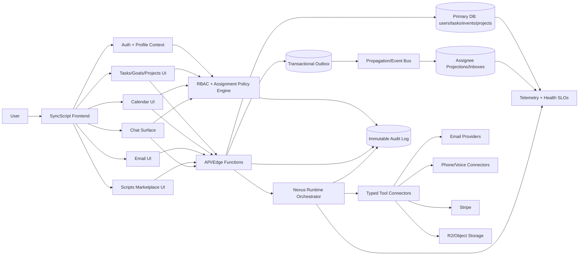
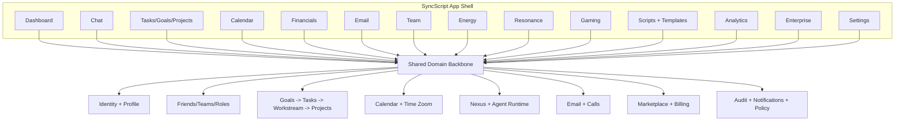
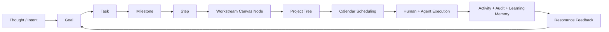
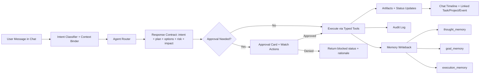

# SyncScript Advanced Task + Chat Vision

## Purpose
**Status:** authoritative

This document translates your full idea dump into an implementation-ready architecture plan.
It focuses on:

- Task modal behavior and UX correctness
- Resource architecture (milestones/steps + cost-safe storage)
- Team collaboration and assignment model
- Human + AI co-execution model (Nexus/Agents as assignees)
- Sidebar evolution into Social/Nexus/Agents chat system
- Project hierarchy strategy (Tasks + Goals + Status + Projects)

### Canonical Navigation Index (Implementation-First)

Read in this order when implementing:

1. `Purpose`
2. `Master Cohesion Audit -> One Intentional Product`
3. `Nexus/OpenClaw Concretization Audit`
4. `Wiring Integrity & Data Determinism Pass`
5. `Role Assignment Architecture (Friends + Agents + Teams)`
6. `Cross-User Collaboration Integrity Architecture`
7. `Execution Board (Single-Row Initiatives)` (single authoritative delivery list)
8. `Architecture Completion Checklist (Go-Live Readiness)`
9. `Light + Airy Expansion Pass`
10. `Visual System Architecture Maps`

---

## Idea Intake Template (Use For New Concepts)
**Status:** contextual

Use this template whenever adding a new brainstorm item, so ideas stay sortable and implementation-ready.

```md
### Idea: <short name>
- **Layer:** <Goals | Tasks | Workstream | Projects | Calendar | Chat | Agent Studio | Platform UX>
- **Problem it solves:** <1-2 lines>
- **User value:** <1-2 lines>
- **Primary user flow:** <step-by-step, 3-6 bullets>
- **Data model impact:** <new fields/entities/relationships>
- **Dependencies:** <teams, APIs, infra, design system>
- **MVP scope (v1):** <what ships first>
- **Deferred scope (v2+):** <what waits>
- **Risks:** <top 3>
- **Mitigations:** <risk controls>
- **Success metrics:** <adoption, latency, completion, retention, etc.>
- **Research links:** <authoritative sources>
- **Decision status:** <idea | evaluating | approved | in progress | shipped | parked>
- **Owner + target phase:** <who/when>
```

### Prioritization rubric

Score each new idea `1-5` in each category, then total:

- **Strategic fit** (does it strengthen SyncScript's core differentiation?)
- **User impact** (frequency x importance)
- **Implementation effort** (inverse-scored: lower effort = higher score)
- **Technical risk** (inverse-scored)
- **Revenue/retention leverage**

Use the total to tag:

- `P0`: start now
- `P1`: next phase
- `P2`: backlog/park

---

## Immediate Fixes Applied
**Status:** historical

The following are already implemented now:

1. **Milestones tab reset bug fixed**
   - Root cause: the task modal reset `activeTab` to `overview` whenever task props updated.
   - Fix: only reset to `overview` when switching to a *different task id*.
   - Result: adding/suggesting milestones stays on `milestones`.

2. **INP spike reduced on Team tab**
   - Root cause: `window.prompt()` blocked the main thread.
   - Fix: replaced with non-blocking `Add Team Members` modal + multi-select flow.
   - Result: lower interaction latency and smoother updates.

3. **Console noise/CORS/401 impact reduced**
   - Root cause: repeated remote profile fetches when endpoint auth/CORS path was not aligned.
   - Fix: add graceful remote-profile fallback mode after 401/403/network failure, then use local default profile state.
   - Result: fewer repeated failing requests + cleaner console behavior.

---

## Your Product Direction (Normalized)
**Status:** authoritative

You are designing a **co-creation operating system**:

- Human planning + human collaboration
- AI assistants as workers, not just advisors
- Deep artifact generation connected to execution units (task/milestone/step)
- Persistent communication in context (friends, teams, collaborators, agents)

That is a strong, differentiated direction.

---

## Task Modal: Recommended End-State
**Status:** authoritative

### 1) Overview

Keep this as a consolidated summary and include:

- Progress by milestone and step
- Assigned humans and agents
- Upcoming next actionable item
- Resource preview strip (latest 3)

### 2) Milestones

Required capabilities:

- Add/suggest milestone with task-aware suggestions
- Reorder milestones via drag-and-drop
- Nested step reorder within each milestone
- Assign owners at milestone or step level
- Resource attachment directly at milestone and step

### 3) Resources

Global index view for all resources:

- Filters: `task`, `milestone`, `step`
- Type filters: `doc`, `image`, `pdf`, `link`, `generated`
- Origin filters: `human`, `nexus`, `agent`
- Storage usage meter per task/project

### 4) Team

Required:

- Add members via picker modal (done baseline)
- Show role, ownership counts, completion stats
- Assignment matrix:
  - rows = milestones/steps
  - columns = teammates + agents
  - cells = assigned/unassigned

### 5) Activity

Event-sourced audit feed:

- Created milestone
- Reordered steps
- Assigned teammate/agent
- Agent run started/completed
- Resource generated/uploaded
- Completion/reopen actions

---

## AI Assignment Semantics (Nexus + Agents)
**Status:** authoritative

This is the most important model to lock now.

### Ownership Modes

Each work item (`task`, `milestone`, `step`) should support:

- `owner_mode = human_only`
- `owner_mode = agent_only`
- `owner_mode = collaborative`

### Execution Policy

- `human_only`: agent can suggest, cannot auto-complete.
- `agent_only`: when item becomes active, assigned agent may execute and auto-complete (if guardrails pass).
- `collaborative`: both human + agent assigned; completion requires human confirmation or policy approval depending on risk.

### Order Constraints

Every step should support:

- `depends_on[]` (explicit dependencies)
- optional `execution_order` index

Agents should only execute items where all dependencies are satisfied.

---

## Resource Architecture (Free/Low-Cost First)
**Status:** contextual

Your storage concern is correct. Best practical free-first stack:

1. **Metadata in Postgres (Supabase)**
   - small, cheap, queryable
   - track ownership, scope (task/milestone/step), size, mime, checksum

2. **Binary storage**
   - Start: Supabase Storage (simple integration)
   - Scale path: Cloudflare R2 for lower egress/storage cost profile

3. **Large uploads**
   - Use resumable uploads (TUS protocol) for reliability on unstable networks

4. **Generated artifacts**
   - Save generated markdown/docs in object storage
   - Keep all generated outputs linked to source execution in activity feed

### Data model recommendation

- `resources`
  - `id`, `task_id`, `milestone_id`, `step_id`, `kind`, `origin`, `storage_url`, `size_bytes`, `checksum`, `created_by`, `created_at`
- `resource_versions`
  - allows evolution/history for generated assets

---

## Sidebar Evolution: Social / Nexus / Agents
**Status:** historical

Your IA is strong. Recommended rollout:

### Phase A: Information architecture only

- Top tabs: `Social | Nexus | Agents`
- Social subtabs: `Friends | Teammates | Collaboratives`
- Left rail: recents (avatar + status ring)
- Main pane: profile header (25%) + conversation (75%)

### Phase B: Messaging core

- Real-time messaging with channel model
- Thread + unread + typing + presence

### Phase C: Context integration

- From a chat message, convert to task/milestone/step
- Assign to human or agent directly from message
- Attach generated artifacts to task from chat

---

## Projects in Tasks Area (Family Tree Concept)
**Status:** contextual

Your “family tree” intuition is correct.
Use hierarchical work graph:

- `Project` (root objective/business plan)
  - `Workstreams` (major subdomains)
    - `Milestones`
      - `Steps/Tasks`

This supports:

- Big project decomposition
- Clear ownership
- Independent scheduling by event/date
- Dependency-aware execution by humans + agents

### Suggested tabs

- `Tasks`
- `Goals`
- `Status` (Do / Doing / Done board)
- `Projects` (tree/graph + timeline + ownership map)

---

## Workstream Canvas -> Project Tree (New Planning Layer)
**Status:** authoritative

Your latest idea is strong and can be implemented as a clean pipeline:

`Goals -> Tasks -> Workstream -> Projects -> Calendar`

### Recommended interaction model

1. **Goals (intent layer)**
   - Define outcomes and success criteria first.
   - Keep this layer lightweight and non-scheduled.

2. **Tasks (execution layer)**
   - Break goals into tasks, milestones, and steps (decomposition).
   - Keep ownership/risk metadata on each node (`ownerMode`, `riskLevel`, `requiresHumanConfirm`).

3. **Workstream (composition layer, n8n-like canvas)**
   - Introduce a canvas where users drag milestones/steps out of tasks into a graph.
   - Each node is a reference to an existing task element (not duplicated records).
   - Support edges for dependency/order (`depends_on`) and optional labels (handoff, review, auto-run).

4. **Projects (management layer)**
   - Once a workstream graph is stable, promote it to a named project.
   - Assign people/agents at node or project level.
   - Keep project identity by:
     - color accent (secondary),
     - plus strong text label + icon/emoji (primary),
     - and optional project code (for low-clutter scanning).
   - This avoids over-reliance on color only (accessibility and visual overload risk).

5. **Calendar (time layer)**
   - Schedule project nodes/events after graph design is set.
   - Preserve project lineage so calendar items can be traced back to their graph node.

### Why this is the right structure

- **Matches proven decomposition practice**: hierarchical breakdown from outcomes to work packages is standard in project delivery and reduces ambiguity.[1]
- **Reduces UI heaviness**: separating decomposition (Tasks) from orchestration (Workstream) follows progressive disclosure and lowers cognitive overload.[2]
- **Supports complex dependency planning**: DAG/critical-path style sequencing is better modeled in a graph than in a flat list.[3]

### Calendar zoom recommendation (Year -> Minute on Multi-day)

To support your "zoom all the way in/out" vision without clutter:

1. **Use semantic zoom, not only visual zoom**
   - At far zoom: show projects/workstreams and major milestones.
   - Mid zoom: show tasks + milestone blocks.
   - Near zoom (hour/minute): show step-level time blocks and handoffs.
   - Keep labels and detail density adaptive per zoom level.[4]

2. **Single multi-day timeline with continuous scale**
   - Replace strict mode switching for deep planning with one zoomable timeline in multi-day view.
   - Day/week/month/year tabs can still exist as shortcuts, but the zoomable timeline is the power view.

3. **Constraint and readability rules**
   - Avoid label overlap at all zoom levels.
   - Pin critical path/dependency edges only when zoomed in enough.
   - Collapse low-priority nodes automatically at coarse zoom.

### Implementation recommendation (incremental)

**Phase A (data model + no-canvas UI)**
- Add `workstreamId`, `projectId`, `parentNodeId`, `dependsOn[]`, `nodeType`.
- Add "Promote to Workstream" action from milestone/step.

**Phase B (canvas MVP)**
- Add node graph editor for milestones/steps with drag, connect, and grouping.
- Add project promotion flow + ownership assignment.

**Phase C (calendar semantic zoom)**
- Add zoom scale controls to multi-day timeline.
- Add level-of-detail rendering (project/milestone/task/step).
- Add minute-level snapping only in high zoom.

### Risks + mitigations

- **Risk: too many tabs / cognitive load**
  - Mitigation: keep `Workstream` initially as a subview inside `Projects` until usage justifies full top-level tab.
- **Risk: visual noise from project coloring**
  - Mitigation: color as accent only; primary identity should be label + icon + grouping.
- **Risk: scheduling complexity explosion**
  - Mitigation: enforce dependency validation and suggest critical path warnings before calendar publish.

### Research references for this section

1. PMI Work Breakdown Structure practice standard and decomposition model:  
   <https://www.pmi.org/standards/work-breakdown-structures-third-edition>

2. Nielsen Norman Group - Progressive Disclosure:  
   <https://www.nngroup.com/articles/progressive-disclosure/>

3. PMI library - Critical Path Method fundamentals:  
   <https://www.pmi.org/learning/library/critical-path-method-calculations-scheduling-8040>

4. Semantic zoom and level-of-detail timeline interaction concepts:  
   <https://cacm.acm.org/news/zoom-in-zoom-out/>

---

## Goal-Linked Tasks + Nexus Memory Loop (New Core System)
**Status:** authoritative

This is the missing bridge you just identified:

`Thought/Conversation -> Goal -> Task Plan -> Workstream -> Project -> Scheduled Execution -> Resonance`

### 1) Add explicit Goal -> Task linking in product model

Recommendation: make goal linkage first-class (not inferred from text only).

**Data model additions**
- `goals` table/entity:
  - `id`, `title`, `why`, `targetDate`, `status`, `ownerId`
  - `successCriteria[]`, `motivationTags[]`
- `tasks` updates:
  - `goalId` (nullable), `goalPriorityWeight` (0-1), `goalOutcomeType`
- `milestones/steps`:
  - inherit `goalId` from parent task by default
  - optional override for multi-goal work

**UI additions**
- Task create/edit: `Linked Goal` selector
- Goal detail: "Create task from goal" and "Attach existing task"
- Dashboard cards: optional goal badge on tasks

Why: explicit, specific goals and feedback loops are strongly tied to better performance than vague intent-only tracking.[1]

### 2) Nexus memory architecture for "dream -> plan" guidance

Use three memory channels:

1. **Thought stream (raw conversational signals)**
   - user wishes, frustrations, ideas, "I wish I could..."
2. **Goal memory (structured intent)**
   - stable goals extracted/confirmed by user
3. **Execution memory (project artifacts)**
   - tasks, workstreams, schedules, outcomes

Nexus should **not auto-promote** raw thoughts into projects without consent.
Use a confirmation handoff:
- "I heard a possible goal. Want to plan it now, save for later, or ignore?"

This keeps guidance supportive and non-pushy (autonomy-preserving), aligned with motivational interviewing principles.[2]

### 3) "Nexus Planning Invitation" policy (non-pushy)

Trigger only when one of these appears:
- repeated wish/friction language ("I wish I could...", "I can’t figure out...")
- explicit planning request ("help me plan this")
- high-emotion + high-importance signal over repeated sessions

Then present 3 choices:
- `Plan now`
- `Save as idea`
- `Not now`

Never repeatedly nag after "Not now"; add cooldown + sensitivity controls.

### 4) Guided ideation protocol Nexus can run

Use a lightweight MCII/WOOP-like flow:
- Wish (what you want)
- Outcome (what success looks like)
- Obstacle (main blocker)
- Plan (if-then first action)

Then convert into:
- Goal record
- Starter tasks
- Initial workstream nodes

This method has evidence for improving goal attainment when paired with if-then planning.[3][4]

### 5) Resonance framing (product-level)

Your framing is coherent and can become a measurable model:
- **Thoughts** = signal stream
- **Goals** = direction and meaning
- **Workstream** = coherence and strategy
- **Project + assignments + schedule** = resonance execution

Operationalize with a `resonanceScore` (0-100) combining:
- goal clarity
- plan coherence (dependency health)
- execution consistency
- social/agent collaboration quality

Grounding this in autonomy/competence/relatedness is aligned with SDT motivation evidence.[5]

### 6) Actionable implementation plan (start now)

**Phase A (1-2 sprints)**
- Add `goalId` linkage on task create/edit + task cards
- Add goal selector + attach existing task flow
- Add memory classifier for "idea/wish/planning intent" tags (no auto-create yet)

**Phase B (next 2 sprints)**
- Add Nexus planning invitation policy and consented "Plan now / Save / Not now"
- Generate draft goal + starter tasks from confirmed plan dialogue
- Persist structured goal memory separate from raw chat memory

**Phase C**
- Auto-create workstream seed nodes from approved goal plan
- Add resonance indicators on goal/project overview
- Add calendar handoff wizard (project graph -> schedule)

### 7) Risks and controls

- **Risk:** over-automation can feel invasive  
  **Control:** strict consent checkpoints + no silent project creation
- **Risk:** memory bloat/noise  
  **Control:** summarize thought stream into compact structured goal memory
- **Risk:** too many partially-defined goals  
  **Control:** enforce readiness checks before project promotion

### Research references for this section

1. Locke & Latham goal-setting evidence (specific, challenging goals + feedback):  
   <https://www.semanticscholar.org/paper/Building-a-practically-useful-theory-of-goal-and-A-Locke-Latham/ebcd793a6c2f123d038bc95f259dd5e3e05acaea>

2. Motivational interviewing and autonomy-supportive change guidance:  
   <https://www.ncbi.nlm.nih.gov/books/NBK589705/>

3. Implementation intentions meta-analysis (if-then planning, d ~ .65):  
   <https://www.sciencedirect.com/science/article/abs/pii/S0065260106380021>

4. MCII/WOOP meta-analysis for goal attainment:  
   <https://pmc.ncbi.nlm.nih.gov/articles/PMC8149892/>

5. Self-Determination Theory meta-analytic evidence (autonomy/competence/relatedness):  
   <https://link.springer.com/article/10.1007/s11031-016-9578-2>

---

## Performance Targets (INP, UX latency)
**Status:** authoritative

To keep ahead-of-time feel:

- INP p75 < 200ms on dashboard interactions
- Avoid sync blocking APIs (`prompt`, giant sync loops)
- Use virtualization for long lists
- Debounce expensive filters/search
- Batch state updates when adding many nodes
- Precompute assignment summaries with memoization

---

## Memory Strategy for Nexus + Agents (Without Overloading Local Machine)
**Status:** contextual

Do **not** keep global raw memory on local machine only.
Use tiered memory:

1. **Session memory (short-term)**
   - current task context only
2. **User memory (medium-term)**
   - preferences, style, recurring patterns
3. **Org memory (long-term distilled)**
   - compact embeddings/summaries, not full logs

Use summarization + retention windows to avoid storage explosion.

---

## Recommended Implementation Roadmap
**Status:** historical

### Sprint 1 (now)

- Fix modal state continuity (done)
- Team add modal (done baseline)
- Resource attach persistence to milestone/step (next hardening)
- Task-aware milestone suggestion quality upgrade

### Sprint 2

- Drag-and-drop reordering for milestones + steps
- Dependency graph support (`depends_on`)
- AI assignee model with execution policies

### Sprint 3

- Social/Nexus/Agents sidebar skeleton + data model
- Realtime chat core + recents/presence
- Chat-to-task conversion and assignment

### Sprint 4

- Projects tab with hierarchical graph + timeline
- Cross-project rollups and status board integration

---

## Key Technical References
**Status:** contextual

1. Nielsen Norman Group - usability and interaction latency guidance  
   <https://www.nngroup.com/>

2. web.dev INP (Interaction to Next Paint)  
   <https://web.dev/inp/>

3. Supabase Storage docs  
   <https://supabase.com/docs/guides/storage>

4. Cloudflare R2 docs  
   <https://developers.cloudflare.com/r2/>

5. TUS resumable upload protocol  
   <https://tus.io/>

6. Yjs (collaborative shared editing state / CRDT)  
   <https://docs.yjs.dev/>

7. Figma multiplayer architecture (CRDT-inspired references)  
   <https://www.figma.com/blog/how-figmas-multiplayer-technology-works/>

8. React performance guidance  
   <https://react.dev/learn/render-and-commit>

---

## Confirmed Product Decisions (Locked)
**Status:** authoritative

These decisions are now confirmed from your latest direction and should be treated as product truth for implementation:

1. **`agent_only` = auto-complete default**
   - Agents can autonomously complete assigned `event` / `task` / `milestone` / `step`.
   - If the action is high-risk, show a proactive risk flag recommending that a human also joins assignment.

2. **`collaborative` requires human confirmation**
   - If a human is assigned with an agent, completion requires explicit human confirm.
   - Exception: shared/borrowed agents in collaborations can run without local human confirm when configured as external autonomous workers.

3. **Social IA = hard-separated tabs**
   - Keep top-level segmentation (`Social`, `Nexus`, `Agents/Enterprise`) clearly separated.
   - Inside `Social`, keep `Friends`, `Teammates`, and `Collaboratives` as separate lanes.

4. **Projects default view behavior**
   - Default landing can be timeline/recent activity.
   - Selecting a project opens its detailed project tree.
   - Tree UI should avoid the current heavy vertical spine style and use cleaner multi-column composition.

---

## Storage Recommendation (Resources, Images, Files)
**Status:** contextual

### Recommendation: **R2 for binary storage + Supabase for metadata and auth**

For your expected scale (many user-generated images/files, milestone/step attachments), this is the strongest long-term setup:

- Use **Cloudflare R2** for actual file objects (images/docs/media).
- Keep **Supabase Postgres** as source of truth for metadata, ownership, permissions, and indexing.
- Use signed upload URLs and store only object references + metadata in your task/milestone/step records.

Why this is the better scale path:

- **Cost profile**: R2 is generally better for large object workloads and avoids major egress surprises.
- **Scalability**: object storage scales horizontally without stressing your app server or local machine.
- **Product fit**: lets you attach many resources to milestones/steps while keeping task queries fast (metadata only).
- **Portability**: metadata remains in Supabase, so storage backends can evolve later without breaking task structure.

Implementation note:

- If speed-to-launch wins this week, you can ship with Supabase Storage first.
- If your priority is avoiding migration churn, start R2 now with a thin storage abstraction and keep it from day one.

---

## Agent-Created Tasks + Calendar Strategy
**Status:** contextual

### Recommendation

Use **one unified calendar engine** and add **owner filters** (`human`, `agent`, `shared`) rather than building a separate agent calendar.

### Why this is the better architecture

1. **Single source of truth**
   - Reduces drift, duplication bugs, and sync complexity between "human calendar" and "agent calendar".
   - Keeps recurrence, conflict detection, reminders, and reschedule logic in one place.

2. **Proven UX pattern**
   - Mature calendar products already use visibility toggles/overlays instead of forking calendar systems.
   - Users can quickly toggle actor lanes without relearning navigation.

3. **Interoperability**
   - The iCalendar model supports event metadata/categorization, which aligns with tagging events by owner type (`agent`/`human`) and policy class.
   - This preserves external sync options and avoids vendor lock-in to a custom-only schema.

4. **Lower implementation risk**
   - Reusing the current calendar lets you ship agent scheduling faster.
   - Most work becomes filtering, policy badges, and permission gating instead of rebuilding views.

### Implementation Blueprint (Phase 1)

- Extend event/task model with:
  - `created_by_type: 'human' | 'agent'`
  - `owner_mode: 'human_only' | 'agent_only' | 'collaborative'`
  - `requires_human_confirm: boolean`
  - `risk_level: 'low' | 'medium' | 'high' | 'critical'`
- Add UI filters in existing calendar:
  - `All`, `Humans`, `Agents`, `Shared`
  - Save last-used filter preference per user.
- Add visual indicators:
  - agent chip/icon on event cards
  - risk flag on high/critical
  - confirmation-required badge for collaborative items.

### Research References

1. iCalendar core model (RFC 5545):  
   <https://www.rfc-editor.org/rfc/rfc5545>

2. iCalendar categories property (classification pattern):  
   <https://icalendar.org/iCalendar-RFC-5545/3-8-1-2-categories.html>

3. Google Calendar multi-calendar visibility/toggle pattern:  
   <https://support.google.com/calendar/answer/6110849>

4. Asana filtering/grouping by assignee pattern:  
   <https://help.asana.com/hc/en-us/articles/14104942767259-List-view>

---

## Nexus-First + Bring-Your-Own-AI Architecture
**Status:** contextual

This section translates your latest vision into a concrete system design:

- Nexus is the default home experience (briefing + memory + orchestration)
- Users can bring their own AI/accounts as skills
- Scripts/Templates can package agent stacks and workflows
- Calendar, Tasks, Projects, Analytics all stay unified while Nexus operates in the background

### Product Thesis

SyncScript should operate like an **AI orchestration platform**, not a single-model chatbot:

- Nexus = orchestrator and memory interface
- External providers = capability rails (design, research, code, outreach, scheduling, commerce)
- Integrations = standardized action surface (not hardcoded one-off connectors)
- Scripts/Templates = reusable "agent bundles" users can publish and run

### Why this is a strong direction

1. **Distribution leverage**
   - You can adopt new model capabilities quickly without retraining a monolith.
2. **User lock-in by workflow, not model**
   - Durable value sits in memory, automations, templates, and orchestration graph.
3. **Cost-performance routing**
   - Route each sub-task to the best/cheapest suitable provider.
4. **Faster enterprise adoption**
   - BYO connectors + policy controls match how ops teams buy software.

---

## Recommended System Model
**Status:** contextual

### 1) Agent Registry (Core)

Create a first-class `AgentRegistry` layer with normalized metadata:

- `agent_id`
- `display_name`
- `provider_type` (native, mcp, zapier, make, custom-api)
- `capabilities[]` (design, codegen, calendar_ops, social_posting, finance_ops, etc.)
- `required_scopes[]`
- `risk_class` (low, medium, high, critical)
- `execution_mode_defaults` (`human_only`, `agent_only`, `collaborative`)
- `input_schema` / `output_schema`
- `cost_profile` / token budget hints

This enables marketplace listing, policy checks, scheduling, and observability with one schema.

### 2) Tool/Skill Abstraction

Represent every external operation as a typed tool contract:

- `tool_id`
- `agent_id`
- `intent` (e.g., `create_website_mockup`, `post_to_x`, `sync_figma_frame`)
- JSON-schema input/output
- idempotency key behavior
- dry-run support for high-risk classes

This is the backbone for "combine AI as skills."

### 3) Nexus Orchestrator Graph

Nexus should plan and execute a DAG:

- Nodes: tasks/events/milestones/steps/tool calls
- Edges: dependencies, approvals, retries, fallback routes
- Policy gates: based on owner mode + risk class + user plan tier

Your existing owner-mode logic is the correct foundation for this.

### 4) Unified Activity + Memory Bus

Use one append-only event stream for:

- task created/updated/completed
- event scheduled/moved/completed
- agent called/succeeded/failed
- artifact generated/stored/shared
- approvals requested/approved/rejected

Nexus briefing then reads this stream to generate "welcome back" summaries.

---

## Where It Fits in UI
**Status:** contextual

### A) Nexus-First Home

Default post-login route should be a Nexus workspace:

- Top: brief ("Last session summary", "recommended next actions")
- Center: conversational workspace
- Left rail (paid tiers): deep app nav + orchestration graph + agent inbox
- Right rail: artifacts/resources/context stack

### B) Scripts & Templates becomes "Agent Studio + Marketplace"

In `Scripts & Templates`, add:

- **Build tab**: create your own agent bundles (tool chain + prompts + policy defaults)
- **Marketplace tab**: install community/official bundles
- **Runbook tab**: execute with inputs + monitor outputs + save artifacts

Installed bundles appear in Enterprise Agents list (chat/command-ready).

### C) Enterprise/Agents Chat Tab

Keep hard-separated top tabs (`Social`, `Nexus`, `Enterprise/Agents`) as decided.
Add an agent roster panel with:

- status
- permissions/scopes
- recent runs
- average latency/cost
- failure rate + fallback path

---

## Calendar + Agent Scheduling (Final Recommendation)
**Status:** contextual

Keep one calendar engine. Add ownership filters:

- `All`
- `Humans`
- `Agents`
- `Shared`

Do not create a separate agent calendar unless enterprise customers demand strict segregation.
This preserves all existing views and avoids duplicated scheduling logic.

---

## Monetization Fit (Puzzle Alignment)
**Status:** contextual

### Free Tier

- Talk to Nexus
- light suggestions
- limited external actions
- no deep "inside-the-brain" control panels

### Pro Tier

- left navigation unlock
- full task/event/project/analytics integration visibility
- agent filters and policy controls
- script/template install + run

### Agentic/Enterprise Tier

- autonomous runs
- approval workflows
- policy rails
- external connector bundles
- team governance and audit

---

## Security + Governance (Non-Negotiable)
**Status:** authoritative

For BYO-AI + external connectors, enforce:

1. OAuth scope minimization per connector
2. Action-level allowlists (deny by default for high-risk operations)
3. Explicit user approvals for high-risk writes
4. Signed run logs + immutable audit records
5. Per-agent rate limits and spend limits
6. Tool result sandboxing and URL/domain allowlists

---

## Implementation Roadmap (Practical)
**Status:** historical

### Phase 1 (Now)

- Ship owner metadata + filters (in progress)
- Add `createdByType`, `ownerMode`, `riskLevel`, `requiresHumanConfirm` in event/task create/edit paths
- Keep unified calendar with owner filters

### Phase 2

- Agent Registry + tool contracts
- Scripts/Templates -> packaged agent bundles
- Nexus session briefing based on activity stream

### Phase 3

- BYO-AI connectors via MCP/Zapier/Make wrappers
- policy engine integration (risk gates + approvals)
- observability (latency/cost/success dashboards)

### Phase 4

- Nexus-first default home
- pro-gated "inside-the-brain" surfaces
- enterprise orchestration + autonomous agents

---

## Research References
**Status:** contextual

1. Model Context Protocol Spec  
   <https://modelcontextprotocol.io/specification/latest>

2. Zapier MCP docs  
   <https://docs.zapier.com/mcp/home>

3. OAuth 2.0 Authorization Framework (RFC 6749)  
   <https://datatracker.ietf.org/doc/html/rfc6749>

4. OWASP API Security Top 10 (2023)  
   <https://owasp.org/API-Security/editions/2023/en/0x04-release-notes/>

5. NIST AI Risk Management Framework (AI RMF 1.0)  
   <https://www.nist.gov/itl/ai-risk-management-framework>

---

## Platform-Wide Styling Overhaul (Airy "Mont-fort" Direction)
**Status:** contextual

This is a confirmed future workstream after core systems stabilize.
Goal: make the full product feel as light, breathable, and premium as the landing experience.

### Likely Causes of "Clunky/Heavy" Feel

1. Too many dense cards competing at equal visual weight.
2. Inconsistent spacing rhythm across pages and components.
3. High-contrast surfaces used everywhere (not enough hierarchy in depth/material).
4. Overloaded panels with weak progressive disclosure.
5. Animation not always communicating hierarchy/state (motion without semantic purpose).

### Styling System Recommendation

#### 1) Density + Spacing Tokens (Global)
- Define a strict spacing scale (4/8/12/16/24/32).
- Set page-level "comfortable density" as default, compact only for data-heavy views.
- Introduce section breathing zones (larger inter-group spacing than intra-group spacing).

#### 2) Surface Hierarchy
- Reduce heavy borders/noise on tertiary containers.
- Use 3 surface tiers max: base, elevated, focus.
- Standardize card shadow/blur intensity to avoid visual chaos.

#### 3) Typography + Contrast
- Build a typographic hierarchy with 3 primary text levels and capped color variants.
- Improve scanability with stronger title/subtitle/body consistency.
- Reserve highest contrast for primary actions and critical alerts only.

#### 4) Motion Semantics
- Keep motion subtle and purposeful: reveal, transition, confirm.
- Standardize durations/easing by interaction type.
- Respect reduced-motion preferences globally.

#### 5) Information Architecture Cleanup
- Expand progressive disclosure patterns (collapsed groups, secondary details on demand).
- Move low-frequency actions into context menus.
- Keep primary task flows one-screen, one-intent.

### Rollout Plan

#### Phase A - Foundation
- Design token audit (spacing, radii, shadows, typography, color ramps).
- Create "Airy UI spec" with before/after examples.

#### Phase B - High-Traffic Pages
- Dashboard, Calendar, Tasks modal, Nexus workspace.
- Measure impact on completion time, error rate, and session depth.

#### Phase C - Full Product Sweep
- Apply system to secondary pages and enterprise tools.
- Remove one-off style exceptions and ad hoc spacing.

### Success Metrics
- Lower click friction for top flows.
- Reduced rage-clicks/backtracking.
- Faster first-action time after page load.
- Higher session completion rate on task/calendar workflows.

---

## Long-Horizon Concept: Office -> City Agent Simulation
**Status:** historical

This is intentionally parked as a later strategic initiative (not immediate roadmap).

### Vision Summary

Start with a small office where your active agents appear in-world.
As users grow capability (agents, projects, enterprise maturity), the world expands:

- room -> office floor -> building -> district -> city
- unlocks tied to achievement/progression, not random cosmetics only
- "living enterprise" visualization: work happening in space, not just dashboards

### Why this can work (if done carefully)

1. Makes invisible automation visible and emotionally legible.
2. Reinforces progress loops (achievement + ownership + status).
3. Turns enterprise orchestration into a discoverable, social artifact.

### Design Guardrails

- Keep productivity first; simulation must support, not replace, work clarity.
- Use opt-in progression mode (never block core task/calendar flows).
- Avoid manipulative loops; prioritize autonomy, competence, and social meaning.
- Tie unlocks to meaningful outcomes (completed projects, reliable agents, team impact).

### Suggested Technical Path

#### Stage 1 (Lightweight)
- 2D/iso "office presence" panel in enterprise area.
- Agents represented as stateful entities (idle/running/waiting approval/failed).

#### Stage 2 (Operational Visualization)
- Map projects and workflows to rooms/areas.
- Click entity -> open run logs/artifacts/actions.

#### Stage 3 (City Layer)
- Multi-office campuses for advanced enterprises.
- Mobility/travel/social visit systems only after core governance is mature.

### Nexus/OpenClaw Question (Autonomy)

What makes OpenClaw feel autonomous is likely not one model; it is system architecture:

- durable goal state and memory
- tool/action execution runtime
- background workers with retries
- policy rails + approvals
- observable run logs and recovery

For Nexus, preserve this architecture and expose it with better UX, not hidden complexity.

---

## Additional Research References
**Status:** contextual

6. NN/g: Visual Hierarchy  
   <https://www.nngroup.com/articles/visual-hierarchy-ux-definition/>

7. NN/g: Principles of Visual Design  
   <https://www.nngroup.com/articles/principles-visual-design/>

8. Material 3 Layout + Density  
   <https://m3.material.io/foundations/layout/understanding-layout/density>

9. Apple HIG (Motion)  
   <https://developer.apple.com/design/human-interface-guidelines/motion>

10. Self-Determination Theory (motivation model)  
    <https://selfdeterminationtheory.org/>

11. Octalysis framework overview  
    <https://yukaichou.com/gamification-examples/octalysis-complete-gamification-framework/>

---

## Master Cohesion Audit -> One Intentional Product
**Status:** authoritative

This section bridges idea-space to product-space: what exists now, what is out of place, what should be merged/moved, and the cleanest path to a cohesive "Nexus-first" SyncScript.

### Product North Star (Locked)

- **Primary experience:** Nexus-first planning and execution.
- **Core transformation:** Thought -> Goal -> Task -> Workstream -> Project -> Calendar -> Resonance.
- **Design objective:** powerful depth with lightweight surface (Apple-like clarity and progressive disclosure).
- **Rule:** if a feature does not serve this chain, remove it or reposition it.

### Current state by tab (codebase reality)

Below is the practical maturity assessment from implementation audit:

- **Tasks:** strong core, mixed polish; real CRUD and policy flows, still some debug/mocks around edges.
- **Calendar:** rich but partially unfinished; zoom/date-picker polish gaps and local persistence paths still present.
- **Financials:** backend is strong; frontend experience still feels sparse/unified poorly with goals/tasks.
- **Email:** meaningful backend automation exists; orchestration UX not yet deeply tied into task/project flow.
- **Agents (to become Nexus):** powerful backend/bridge capability; UI still partly split between production and fallback behavior.
- **Energy:** solid local model and UX, but needs stronger cross-device/system-level persistence strategy.
- **Resonance Engine:** advanced concept and useful mechanics; needs tighter linkage to goals/projects execution outcomes.
- **Team:** useful collaboration shell, but semantic overlap with chat/enterprise needs cleanup.
- **Gaming:** still partially blocked by "coming soon" state.
- **Scripts & Templates:** not yet consistently productized; checkout/linking and publishing flow need hardening.
- **Analytics:** partially scaffolded, still not surfaced as a fully live decision layer.
- **Enterprise:** powerful capability set; needs tighter role boundary and user-facing simplification.
- **Notifications:** currently fragmented; needs one event model and deliberate watch-safe policy.

### Out-of-place inventory (remove, move, or absorb)

1. **Agents tab naming**
- Change primary tab label from `Agents` to **`Nexus`**.
- Make it the first tab in logged-in experience.

2. **All Features menu**
- Remove from logged-in nav.
- Keep feature discovery on marketing/docs surfaces, not app shell.

3. **Mission Cockpit**
- Remove from primary individual nav.
- Relocate to:
  - `Settings > Advanced` and/or
  - Enterprise mode only, and
  - optional downloadable companion entry from landing page.

4. **Team tab chat overlap**
- Remove chat responsibilities from Team tab.
- Team tab should be ownership/collaboration administration and accountability, not primary messaging.

### Recommended IA reorganization (cohesive menu)

#### Primary nav (default, Nexus-first)

- `Nexus` (first/home)
- `Goals`
- `Tasks`
- `Workstream`
- `Projects`
- `Calendar`
- `Financials`
- `Energy`
- `Resonance`

#### Secondary nav (workspace tools)

- `Email`
- `Team`
- `Analytics`
- `Scripts & Templates` (future: Agent Studio + Marketplace)

#### Conditional/advanced nav

- `Enterprise` (only when org/plan/role conditions are met)
- `Mission Cockpit` (inside Enterprise or Settings advanced)

This structure makes the execution chain visible and intentional while reducing lateral noise.

### How your listed concerns fit cohesively

#### A) Financials integration (currently under-integrated)

Financials should be elevated from "report tab" to "goal-constrained decision layer":

- Add `goalBudget` and `projectBudget` models linked to goals/projects.
- Every project/workstream gets:
  - budget envelope,
  - spend-to-date,
  - burn-rate warning,
  - affordability risk class.
- Financial insights should produce:
  - task suggestions (reduce cost, renegotiate, automate),
  - schedule suggestions (delay/advance based on cash flow),
  - purchase gates for high-risk expenses.

UI cleanup recommendation:
- Replace blank-style panels with 3 core cards:
  - `Runway + cash forecast`,
  - `Budget by project`,
  - `Action queue` (what to do this week).
- Keep advanced analytics behind expandable sections (progressive disclosure).

#### B) Email + phone + task/project execution

Email and calls should become **work inputs and work outputs**:

- Convert important email threads into:
  - goal candidates,
  - tasks,
  - milestones,
  - project workstream nodes.
- Add automation recipes:
  - "when email matches X -> create task + draft response"
  - "when milestone completed -> send update email"
- Add call actions at task level:
  - `Call contact now`,
  - `Ask Nexus to place call`,
  - `Schedule follow-up call`.

For Nexus calling on user behalf:
- require explicit permission + contact intent confirmation + auditable transcript.
- default to high-trust domains first (bookings, scheduling, reminders), then broaden.

#### C) Chat model with Nexus (project-specific vs general)

Use **multi-thread memory with explicit mode**:

- `General Nexus` thread: broad life/work dialogue.
- `Project threads`: one thread per project/workstream for focused context.
- `Direct action` mode: user requests single task execution without full project promotion.

Promotion policy:
- Nexus suggests converting conversation into goal/task only with consent.
- User can keep exploratory chats unstructured until they decide to plan.

#### D) Team vs Enterprise boundary

Define this clearly:

- **Project:** scoped delivery unit with defined objective, owners, and timeline.
- **Enterprise:** organization-level governance/runtime layer spanning many projects, policies, and automated agents.

Practical trigger from project -> enterprise:
- multiple active projects +
- cross-project governance needs +
- role/policy management and compliance requirements +
- automated org-wide agent execution.

It is not "enterprise only when all agents"; it is about scale, governance, and cross-project control.

#### E) Scripts & Templates + Stripe flow reliability

Current priority:
- harden paid script purchase routing to Stripe Checkout.
- ensure every purchasable template has:
  - valid product/price mapping,
  - successful redirect,
  - webhook entitlement confirmation.

Add a smoke-test checklist:
- click paid script -> checkout opens,
- test discount code works,
- payment success returns entitlement instantly,
- dashboard reflects access without manual refresh.

#### F) Gaming tab completion decision

Choose one path immediately:

- either keep as intentional beta with clear scope and timeline,
- or hide from default nav until core system cohesion is complete.

Avoid "coming soon" dead-end in primary navigation if cohesion is top priority.

#### G) Notification strategy (including watch)

Adopt a **notification budget**:

- P0 alerts: schedule conflicts, high-risk approvals, critical deadline drift.
- P1 alerts: daily planning brief, major project status changes.
- P2 alerts: optional insights/digest only.

Watch policy:
- only P0 and selected P1.
- terse action-first phrasing.
- one-tap actions where possible (approve, snooze, open task).

### Clean system model (all tabs working as one)

#### Canonical shared entities

- `Thought`
- `Goal`
- `Task`
- `Milestone`
- `Step`
- `WorkstreamNode`
- `Project`
- `Event`
- `Budget`
- `CommunicationArtifact` (email/call/chat)
- `Assignment` (human/internal agent/external agent)
- `Notification`

Every tab should read/write these same entities through unified contracts, not parallel models.

#### Cross-tab integration rules

1. Nexus can propose, never force structure creation without consent.
2. Goals must be linkable to tasks/projects everywhere they appear.
3. Calendar scheduling should preserve project/workstream lineage.
4. Financials should be goal/project-aware, not isolated.
5. Email/phone interactions should be attachable to task/project context.
6. Notifications should originate from one event bus with severity classes.

### Phased execution plan (from now)

#### Phase 0: IA + cleanup freeze (1 sprint)

- Keep current nav for now (stability-first) and preserve `Dashboard` as one-stop overview.
- Plan Nexus-first as a **header pull-down full-page mode** (later phase), not immediate nav rewrite.
- Remove `All Features` from app nav.
- Move/hide Mission Cockpit from individual primary menu.
- Decide Gaming visibility policy (show with value or hide).

#### Phase 1: Goal-linked execution spine (2 sprints)

- Ship `goalId` linkage in tasks and task-create/edit flows.
- Show goal badges on task cards and calendar rows where relevant.
- Add `Goal -> Task` and `Task -> Goal` attach actions.

#### Phase 2: Communications as execution rails (2 sprints)

- Email-to-task/project conversion.
- Triggered email recipes tied to project/workstream states.
- Task-level call actions + Nexus call-request workflow with consent/audit.

#### Phase 3: Workstream/Projects operationalization (2-3 sprints)

- Workstream canvas MVP from task/milestone/step nodes.
- Promote workstream -> project flow.
- Dependency-aware project scheduling handoff to calendar.

#### Phase 4: Financial + resonance unification (2 sprints)

- Project-linked budget envelopes and risk alerts.
- Resonance score linked to goal clarity, coherence, and execution consistency.
- Analytics surfaces made decision-centric, not decorative.

### Risk register (high-impact)

- **Over-complexity risk:** too many visible surfaces at once.  
  Mitigation: progressive disclosure + role-based surface gating.

- **Identity drift risk:** duplicate models across tabs.  
  Mitigation: canonical entities + shared contracts before feature expansion.

- **Automation trust risk:** users feel Nexus is pushy/autonomous beyond intent.  
  Mitigation: consent checkpoints, clear action previews, auditable logs.

- **UX heaviness risk:** dense cards and overloaded panels.  
  Mitigation: spacing/surface hierarchy program and strict navigation simplification.

### Decision updates from your latest notes (locked for next implementation wave)

- `Dashboard` remains the one-stop overview and stays in nav.
- Keep nav structure stable for now; defer major nav IA switch until core cohesion pass lands.
- Nexus-first will be introduced as a **header-triggered pull-down full-page Nexus mode**.
- Team tab is reduced to collaboration/accountability management (chat separated).
- Mission Cockpit removed from primary individual nav path.
- All Features menu removed from in-app navigation.
- Financials must be redesigned as one of the most comprehensive and integrated planning tabs.
- Email/phone become first-class execution tools connected to tasks/projects.
- Multi-thread Nexus model supported (general + project-specific + direct action).

### Additional references for this cohesion plan

1. Apple Human Interface Guidelines (clarity/deference/depth principles):  
   <https://developer.apple.com/design/human-interface-guidelines/>

2. Nielsen Norman Group - Progressive Disclosure:  
   <https://www.nngroup.com/articles/progressive-disclosure/>

3. Stripe Checkout (hosted payment flow reliability baseline):  
   <https://docs.stripe.com/payments/checkout>

4. iCalendar standard reference (event model interoperability):  
   <https://datatracker.ietf.org/doc/html/rfc5545>

5. n8n workflow automation patterns (for workstream-style orchestration inspiration):  
   <https://docs.n8n.io/>

---

## Nexus/OpenClaw Concretization Audit (Why Nexus sometimes fails to "do things")
**Status:** authoritative

### Current gap observed in code

Nexus capability is present but fragmented between advanced backend and fallback-heavy UI/context paths:

- `OpenClawContext` contains multiple phase-gated/fallback routes, including explicit not-yet-implemented paths (e.g., goal suggestion branch and fallback-only behavior).
- This creates perceived inconsistency: some actions are intelligent and autonomous, others silently degrade.

Implication: Nexus feels less concrete because runtime behavior is not uniformly backed by durable orchestration + explicit tool contracts + visible action-state.

### What OpenClaw-style autonomy requires (concrete)

To make Nexus reliably "do real work," implement the complete agent loop:

1. **Plan/Act/Observe loop** (ReAct-like execution path)
2. **Durable execution checkpoints** (resume after interruption/failure)
3. **Typed tool contracts** (`schema`, `idempotency`, `error envelope`)
4. **Policy gates** (approval for irreversible/high-risk actions)
5. **Memory layering** (raw conversation -> structured goals -> execution artifacts)
6. **Trajectory evals** (measure tool-choice quality, not only final response)

This is the core difference between a chat assistant and an operational agent runtime.

### Concrete implementation requirements for Nexus in SyncScript

#### A) Agent Runtime Contract (must-have)
- Unified run object: `runId`, `intent`, `planSteps`, `currentStep`, `status`, `toolCalls[]`, `artifacts[]`, `approvals[]`.
- Every Nexus action returns structured run updates (no opaque one-off side effects).

#### B) Tooling Layer Hardening (must-have)
- Every tool exposed to Nexus gets:
  - JSON schema input validation,
  - deterministic output envelope (`ok/data/error/meta`),
  - idempotency key for side-effect tools (email/send/call/book/pay),
  - retry policy and timeout budget.

#### C) Human-in-the-loop policy (must-have)
- Approval checkpoints for:
  - financial commitments,
  - outbound communication to third parties,
  - irreversible writes.
- Watch-friendly approval surface for high-priority actions.

#### D) Memory concretization (must-have)
- `thought_memory`: raw conversation snippets.
- `goal_memory`: confirmed goals and planning artifacts.
- `execution_memory`: runs, outputs, outcomes, and postmortems.
- Promotion from thought -> goal only with explicit user confirmation.

#### E) Observability & trust (must-have)
- "What Nexus is doing now" panel in Nexus mode:
  - current step,
  - next step,
  - tools used,
  - blockers/approval needed.
- Persist run logs and present auditable history.

### Research basis for these requirements

1. ReAct thought/action/observation architecture:  
   <https://research.google/blog/react-synergizing-reasoning-and-acting-in-language-models/>

2. Durable execution + human interrupts/checkpoints (LangGraph docs):  
   <https://docs.langchain.com/oss/python/langgraph/durable-execution>  
   <https://langchain-ai.github.io/langgraph/concepts/human_in_the_loop/>

3. MCP tool contract and tool-calling protocol:  
   <https://modelcontextprotocol.io/specification/2024-11-05/index>

---

## Dashboard Performance Stabilization Gate (Do Before New Feature Wave)
**Status:** authoritative

This is now a prerequisite: stabilize `/dashboard` responsiveness before major feature rollout.

### Why this is critical

- Current dashboard lag undermines trust and makes every new feature feel worse.
- INP guidance recommends prioritizing long interaction tasks and render bottlenecks first.[1]
- Dashboard is the one-stop overview; if it is slow, the full product perception is slow.

### Evidence-backed bottlenecks found in code (ranked)

1. **Layout/remount churn across dashboard tabs**  
   - Repeated `DashboardLayout` wrapping across pages causes unnecessary shell remount work.
2. **Closed AI panel still mounted**  
   - `AIAssistantPanel` remains active even when hidden, continuing hook/context work.
3. **Onboarding polling loop**  
   - `OnboardingChecklist` polls `localStorage` every 2s.
4. **Continuity heartbeat/background network churn**  
   - periodic heartbeat/presence intervals in `ContinuityContext`.
5. **Duplicate/expensive data computations on dashboard render paths**  
   - conflict/weather calculations and repeated dashboard derivations.
6. **Large always-mounted contexts + broad rerender fanout**  
   - provider updates likely cause wide subtree rerenders.
7. **Hot-path debug logging**  
   - repeated console instrumentation in interactive paths.
8. **Bundle/chunk pressure in heavy pages**  
   - large route chunks increase parse/execute pressure and slow interaction recovery.

### Concrete file hotspots

- `src/App.tsx` (layout/routing composition)
- `src/components/layout/DashboardLayout.tsx`
- `src/components/AIAssistantPanel.tsx`
- `src/components/onboarding/OnboardingChecklist.tsx`
- `src/contexts/ContinuityContext.tsx`
- `src/hooks/useCalendarEvents.ts`
- `src/components/TodaySection.tsx`
- `src/components/CalendarWidgetV2.tsx`
- `src/components/DashboardHeader.tsx`
- `src/contexts/OpenClawContext.tsx` (fallback-heavy behavior and phase gating)

### Performance targets (lock these)

- **INP p75 <= 200ms** on dashboard interactions (Core Web Vitals target).[1]
- **Tab switch to interactive <= 300ms** on warmed session.
- **No perpetual 2s polling loops** on dashboard.
- **No hidden heavy panels mounted by default**.
- **No high-frequency render-path console logging in production paths**.

### Implementation sequence (organized)

#### P0 quick wins (first 3-5 days)
- Make `DashboardLayout` a shared route wrapper (stop repeated remounts).
- Conditionally mount `AIAssistantPanel` only when opened.
- Remove/replace 2s onboarding polling with event-driven updates.
- Gate/slow heartbeat work by visibility/activity state.
- Strip or hard-gate hot-path debug logs.

#### P1 architecture hardening (next 1-2 sprints)
- Centralize calendar/weather/conflict derivations into memoized selectors/shared stores.
- Reduce provider rerender fanout (split contexts, memoized values, selector-based consumption).
- Throttle localStorage writes and move hot state to in-memory + idle flush.

#### P2 sustained performance (ongoing)
- Chunk/lazy split heavy dashboard subpanels.
- Add dashboard perf telemetry panel (INP, long tasks, render time by route).
- Add regression budget checks before merging major UI work.

### Research references for this section

1. web.dev INP optimization guidance:  
   <https://web.dev/articles/optimize-inp>

2. React profiler/performance tracks and rerender optimization:  
   <https://react.dev/reference/dev-tools/react-performance-tracks>

---

## Immediate UI Cohesion Changes (Requested)
**Status:** contextual

These are now explicitly tracked as near-term cleanup:

1. Remove `AI Extract` button near dashboard search  
   - current location: `src/components/DashboardHeader.tsx`

2. Move Discord entry from floating bottom-right CTA to profile menu  
   - current floating component usage: `src/App.tsx` + `src/components/FloatingFeedbackButton.tsx`
   - target host: user profile menu in `src/components/ProfileMenuNew.tsx`

3. AI page card relocation cleanup  
   - move `Current Context` and `Learning Progress` cards out of AI page into Analytics context (or remove if redundant)
   - current source: `src/components/pages/AIAssistantPage.tsx`

4. Task page card declutter  
   - remove `Energy Optimization` and adjacent non-essential insight card from tasks area if duplicative
   - current source: `src/components/pages/TasksGoalsPage.tsx`

---

## Wiring Integrity & Data Determinism Pass (No Dead/Mock Surfaces in Live Product)
**Status:** authoritative

This pass ensures SyncScript production behavior is deterministic, connected, and never silently falls back to demo/random identities.

### A) No dead cards / no disconnected cards policy

Any card in production UI must be one of:
- **Live connected data**, or
- **Feature-flagged beta card** with explicit label and disabled by default in production.

Remove or relocate cards that are:
- mock-only,
- disconnected from backend state,
- placeholder-only in core workflow tabs.

### B) Today's Schedule card hard requirements

Requested and locked:
- Remove quick filter chips from the card.
- Keep scroll behavior reliable and predictable.

Implementation notes:
- Remove quick filters block in `src/components/TodayScheduleRefined.tsx`.
- Ensure task list region has stable scroll container behavior:
  - fixed flex sizing chain (`min-h-0` on parents),
  - `overflow-y-auto` with safe fallback styles,
  - avoid parent `overflow-hidden` clipping the scroll region.
- Keep Do/Doing lanes and Next Up intact.

### C) Identity/profile/level reset prevention

Observed risk sources include:
- static identity constants (`CURRENT_USER` = Jordan Smith),
- local fallback IDs (`user-1`) in some team/energy paths,
- sample-data bootstrap logic on dashboard,
- mock/random seeded data code paths.

Production rule:
- Never source live identity/profile/level from constants or mock defaults after auth handshake.
- Use server-backed user profile as canonical source.
- If profile fetch fails, show "degraded state" UI but do not revert identity to demo user.

### D) Random task/event injection prevention

Production rule:
- No automatic sample/task/event insertion in live mode unless user explicitly enables demo workspace.
- Disable implicit sample-data bootstrap in production builds.
- Seed/demo generators must be dev-only or gated by explicit feature flag.

### E) Email UX wiring (requested direction)

Requested direction:
- Keep split-pane reading experience (list left, selected email right).
- Ensure robust delete + reply in-app.

Current implementation notes:
- Split-pane exists; currently includes a third "Action Cockpit" column.
- Reply flow exists in-app with send endpoint.

Recommended product adjustment:
- Default to clean 2-pane mode (list + reading).
- Make Action Cockpit collapsible/secondary panel (optional) to reduce visual heaviness.
- Add explicit delete action with provider-consistent behavior:
  - Gmail/Outlook: move to trash/archive by provider API policy.
- Keep sent/reply audit trail tied to task/project context.

### F) Production-safe wiring checklist

- [x] No primary-tab cards running on mock/fallback-only data without explicit label.
- [x] No default identity fallback to Jordan/user-1 in authenticated sessions.
- [x] No hidden random/sample inserts in live mode.
- [x] Tasks/calendar/profile all loaded from canonical user-scoped stores.
- [x] Email delete/reply actions fully wired and reflected in UI state immediately.

### G) Locked decisions (2026-02-27)

Based on latest product decisions:

1. **Sample/demo data policy:** **Yes** -> disable implicit sample/demo data in production.
2. **Identity fallback hardening:** **Yes** -> strengthen identity/profile handling using resilient patterns from leading SaaS products:
   - canonical server profile source only after auth,
   - stale-while-revalidate cache of last known good profile,
   - degraded banner + retry path on outage,
   - never swap authenticated user to demo identity.
3. **Email delete semantics:** **Yes** -> default delete means provider Trash (recoverable). Hard delete can be optional in settings.
4. **Action Cockpit placement recommendation:** keep **2-pane email** as default and move AI actions to a **secondary tab** in the right pane (`Message | Actions`) instead of a persistent third column.
5. **Today's Schedule scrollbar behavior:** hidden by default, visible while scrolling/hovering only.
6. **Task card simplification recommendation:** after removing filters, keep only:
   - title,
   - due-time signal,
   - single priority marker,
   - compact assignee indicator.
   Remove non-essential chips/badges from the default row; show detail on hover or in modal.

### H) Dead/mock production audit snapshot (current)

Immediate findings from code scan:

- `src/components/pages/TasksGoalsPage.tsx` still imports `../../data/calendar-mock` and contains large hardcoded sample entities; this is a production determinism risk.
- `src/contexts/TeamContext.tsx` uses `CURRENT_USER_ID = 'user-1'` in runtime paths; this can cause identity drift/reset behavior.
- `src/contexts/GamificationContext.tsx` is seeded from `CURRENT_USER` constants; profile/level can revert when canonical profile flow is disrupted.
- `src/App.tsx` still mounts `FloatingFeedbackButton`; if keeping dashboard clean-first policy, this should be moved behind profile/support entry or feature flag.
- `src/components/DashboardHeader.tsx` still contains the `AI Extract` control path and should be removed per dashboard cleanup decision.

Result: **There are still mock/dead/fallback production risks present and they should be treated as Sprint 0 blockers for go-live.**

---

## Consistency Audit v2 (Post-Update)
**Status:** historical

This pass checks internal plan consistency after the latest updates.

### Confirmed consistent (good)

- Dashboard remains primary overview and stays in nav.
- Large nav reorganization is deferred; stabilization-first is active.
- Nexus-first is implemented later as header pull-down full-page mode.
- Performance stabilization now gates feature expansion.
- Execution board now starts with performance items before UI cleanup.

### Remaining wording drifts to normalize

1. Older sections still reference `Social | Nexus | Agents` as fixed top tabs.
2. New direction is that AI Insights toggle is renamed to **Chat** and agent communication design should be unified there.
3. Some historical phrasing assumes immediate nav rename from Agents -> Nexus; this is now deferred.

### Normalization rule (applies going forward)

- Use **Chat tab** as the canonical name for the former AI Insights surface.
- Inside Chat, use modes/threads rather than hard-coded product-silo tabs where possible.
- Keep nav changes deferred unless they are cleanup/stability fixes.

---

## Chat Tab Agent Communication & Execution Map
**Status:** authoritative

This defines how users talk to Nexus/agents, how requests are routed, and how agent actions execute safely and predictably.

### Product objective

Make Chat the orchestration surface where users can:
- ask questions,
- plan projects,
- delegate tasks,
- monitor action progress,
- and approve risky operations.

All without losing context across goals/tasks/projects/calendar.

### Industry pattern synthesis (and how we do better)

#### What leading products do well

1. **Project/workspace context persistence**  
   - ChatGPT Projects and Claude Projects keep chat + files + instructions scoped by project context.[1][2]
2. **Knowledge spaces for long-running work**  
   - Perplexity Spaces keeps topic threads + files together for continuity.[3]
3. **Human-in-the-loop execution controls**  
   - n8n HITL patterns for approve/deny before tool actions.[4]
4. **Escalation logic and handoff quality**  
   - Intercom Fin patterns for deterministic escalation and no looped retries.[5]

#### Where SyncScript can do better

- Unify planning + execution + scheduling in one system (not separate chat and project products).
- Add goal-linked execution semantics directly in the chat action flow.
- Show transparent "agent run state" with approvals, tool calls, and artifacts, not black-box replies.

### Chat architecture (recommended)

#### 1) Thread types (canonical)

- `general_nexus` — broad life/work conversation
- `project_thread` — scoped to one project/workstream
- `goal_thread` — scoped to one goal and its options
- `task_execution_thread` — direct execution of concrete tasks
- `social_thread` — friend/team/collaborative messaging (non-agent primary)

Each message carries:
- `threadType`
- `threadId`
- `goalId?`
- `projectId?`
- `taskId?`

#### 2) Agent roles

- **Nexus Orchestrator** (default): planner/router/explainer.
- **Task/Goal Agent**: decomposition, sequencing, acceptance criteria.
- **Calendar Agent**: scheduling/dependency/time-window optimization.
- **Financial Agent**: budget/risk/affordability planning.
- **Comms Agent (Email/Phone)**: templates, outreach, call orchestration.
- **Specialized external agents** (Zapier/Rube/MCP tools): bounded tool execution.

#### 3) Routing model

Priority order:
1. Explicit mention (`@calendar`, `@financial`) if provided.
2. Intent classifier on user message.
3. Nexus orchestrator fallback with "recommended agent" suggestions.

Routing output must be explicit:
- `selectedAgent`
- `whySelected`
- `confidence`
- `alternatives[]`

### Agent response contract (how they should respond)

Every actionable agent response should include:

1. **Intent understanding**
   - "Here is what I think you want."
2. **Plan proposal**
   - 3-7 steps with dependencies.
3. **Execution options**
   - `Do it now`, `Draft first`, `Need approval`, `Save as plan`.
4. **State impact preview**
   - what entities change (`goal`, `task`, `workstream`, `calendar`, `financial`).
5. **Risk + confidence**
   - risk level + required approval if needed.

No hidden execution: every side-effect action should appear as an action card.

### Task delegation lifecycle (if user asks agents to do things)

State machine:

`requested -> clarified -> planned -> waiting_approval (optional) -> running -> completed | failed | cancelled`

For each run:
- show current step,
- show next step,
- show tool calls,
- attach artifacts/results,
- keep audit trail.

This aligns with the OpenClaw/Nexus concretization requirements above.

### Approval and trust policy

Approval mandatory for:
- payments/financial commitments,
- external communications,
- destructive or irreversible updates.

Approval UX:
- in-chat action card,
- optional watch notification for P0/P1 items,
- single-tap approve/deny/snooze.

### Memory behavior in chat

- Raw conversation -> `thought_memory`
- Confirmed intention -> `goal_memory`
- Executed runs/artifacts -> `execution_memory`

Promotion rule:
- thoughts are not auto-promoted into projects without explicit user confirmation.

### UX behavior (non-pushy guidance)

Nexus should use invitation language:
- "Want to plan that now?"
- "Save as idea?"
- "Not now?"

If user declines, apply cooldown before prompting again to avoid pressure loops.

### Where this goes in current product

- Rename AI Insights toggle surface label to **Chat**.
- Keep existing nav stable.
- Implement thread mode selector inside Chat first (not a nav overhaul).
- Add project thread switcher and "attach to goal/project/task" controls in chat composer.

### Additional references for this section

1. OpenAI Projects + GPT Actions patterns:  
   <https://help.openai.com/en/articles/10169521-using-projects-in-chatgpt>  
   <https://platform.openai.com/docs/actions/introduction>

2. Anthropic Projects/context-management patterns:  
   <https://www.anthropic.com/news/projects>  
   <https://docs.anthropic.com/en/docs/claude-code/memory>

3. Perplexity Spaces workspace organization:  
   <https://www.perplexity.ai/help-center/en/articles/10352961-what-are-spaces>

4. n8n human-in-the-loop tool-call controls:  
   <https://docs.n8n.io/advanced-ai/human-in-the-loop-tools/>

5. Intercom Fin escalation/handoff rules:  
   <https://www.intercom.com/help/en/articles/12396892-how-to-automatically-escalate-conversations>

---

## Execution Board (Single-Row Initiatives)
**Status:** authoritative

Use this as the immediate implementation command board.

| ID | Initiative | Scope | Owner | Depends On | Risk | Status | Target |
|---|---|---|---|---|---|---|---|
| PERF-001 | Shared dashboard layout routing | stop shell remount on tab/page changes | FE | none | medium | shipped | Sprint 0 |
| PERF-002 | Conditional mount AI panel | avoid hidden heavy panel work | FE | PERF-001 | low | shipped | Sprint 0 |
| PERF-003 | Replace onboarding polling loop | remove 2s storage polling churn | FE | PERF-001 | low | shipped | Sprint 0 |
| PERF-004 | Continuity heartbeat gating | reduce background churn by visibility/activity | FE + BE | PERF-001 | medium | shipped | Sprint 0 |
| PERF-005 | Hot-path log stripping/guarding | remove interaction-path console overhead | FE | none | low | shipped | Sprint 0 |
| PERF-006 | Dashboard perf telemetry baseline | instrument INP and route interaction timings | FE | PERF-001 | medium | shipped | Sprint 0 |
| PERF-007 | Analytics egress noise guard | suppress high-frequency Plausible perf-event forwarding + add client-side rate limiting to avoid CORS/429 console storms on production hosts | FE | PERF-006 | low | shipped | Sprint 0 |
| EX-001 | Remove AI Extract from header | `DashboardHeader` UI cleanup | Product + FE | PERF-005 | low | shipped | Sprint 0 |
| EX-002 | Move Discord from FAB to profile menu | de-emphasize floating CTA, keep support discoverable | Product + FE | EX-001 | low | shipped | Sprint 0 |
| EX-003 | Remove All Features nav dead entry | nav consistency + no dead route | FE | PERF-001 | low | shipped | Sprint 0 |
| EX-004 | Mission Cockpit relocation | move from individual primary nav | Product + FE | EX-003 | low | shipped | Sprint 0 |
| EX-005 | AI card relocation (Current Context/Learning Progress) | move to Analytics or remove | Product + FE | EX-003 | low | shipped | Sprint 0 |
| EX-006 | Tasks tab card declutter | remove low-value duplicate cards | Product + FE | EX-005 | low | shipped | Sprint 0 |
| EX-007 | Goal linkage model (`goalId`) | tasks-goals data bridge | FE + BE | none | medium | shipped | Sprint 1 |
| EX-008 | Goal selector in task create/edit | task UX integration | FE | EX-007 | medium | shipped | Sprint 1 |
| EX-009 | Goal badges in task/calendar surfaces | cross-tab traceability | FE | EX-007 | low | shipped | Sprint 1 |
| EX-010 | Nexus runtime contract (`runId`, steps, status) | concrete autonomous execution spine | BE + AI | none | high | shipped | Sprint 1-2 |
| EX-011 | Typed tool contract hardening | schema + idempotency + error envelopes | BE + AI | EX-010 | high | shipped | Sprint 2 |
| EX-012 | Approval policy engine integration | high-risk gated actions | BE + FE | EX-010 | high | shipped | Sprint 2 |
| EX-013 | Memory layering implementation | thought/goal/execution separation | BE + AI | EX-010 | high | shipped | Sprint 2 |
| EX-014 | Nexus "what I’m doing now" panel | trust and observability UX | FE + AI | EX-010 | medium | shipped | Sprint 2 |
| EX-015 | Email -> task/project conversion | communication-to-execution bridge | FE + BE | EX-007 | medium | shipped | Sprint 2 |
| EX-016 | Task-level call actions + Nexus call workflow | phone integration with consent | FE + BE | EX-012 | high | shipped | Sprint 2-3 |
| EX-017 | Workstream canvas MVP | drag nodes from task breakdown into graph | FE + BE | EX-007 | high | shipped | Sprint 3 |
| EX-018 | Workstream -> project promotion flow | project creation from graph | FE + BE | EX-017 | medium | shipped | Sprint 3 |
| EX-019 | Calendar semantic zoom (year->minute in multi-day) | timeline depth and planning coherence | FE | EX-018 | high | shipped | Sprint 3-4 |
| EX-020 | Financials redesign as planning center | budget-to-goal/project integration | FE + BE | EX-007 | high | shipped | Sprint 4 |
| EX-021 | Notifications event model + watch budget | reduce noise, improve actionability | FE + BE | EX-012 | medium | shipped | Sprint 4 |
| EX-022 | Scripts/Templates Stripe path hardening | checkout and entitlement reliability | FE + BE | none | medium | shipped | Sprint 1 |
| EX-023 | Gaming tab decision gate | ship value or hide from primary nav | Product + FE | EX-003 | low | shipped | Sprint 0 |
| EX-024 | Nexus pull-down full-page mode prototype | Nexus-first without nav breakage | FE + Product | EX-010 | medium | shipped | Sprint 3 |
| EX-025 | Rename AI Insights surface to Chat | terminology + IA consistency | Product + FE | EX-001 | low | shipped | Sprint 0 |
| EX-026 | Chat thread model implementation | general/project/goal/task/social thread types | FE + BE | EX-025 | high | shipped | Sprint 1-2 |
| EX-027 | Agent router + mention handling | deterministic agent selection + confidence reporting | AI + BE | EX-026 | high | shipped | Sprint 2 |
| EX-028 | Agent response contract cards | plan/options/risk/impact standard response blocks | FE + AI | EX-027 | medium | shipped | Sprint 2 |
| EX-029 | Delegation lifecycle state machine | requested->planned->running->completed/failed | BE + FE | EX-010 | high | shipped | Sprint 2 |
| EX-030 | Approval cards + watch actions | high-risk approve/deny/snooze UX | FE + BE | EX-012, EX-021 | high | shipped | Sprint 2-3 |
| EX-031 | Project thread context binding | attach chat actions to goal/task/project/workstream IDs | FE + BE | EX-026, EX-007 | medium | shipped | Sprint 2-3 |
| EX-032 | Non-pushy prompt cadence controls | invitation/cooldown logic in Nexus coaching prompts | AI + FE | EX-013 | medium | shipped | Sprint 3 |
| EX-033 | RBAC scope model + role bindings | canonical role/scope authorization model | BE + FE | EX-007 | high | shipped | Sprint 1-2 |
| EX-034 | Assignment policy engine | task/event/project assignment permission checks | BE | EX-033 | high | shipped | Sprint 2 |
| EX-035 | Unified assignment picker + guardrails | single UI with role-aware controls/messages | FE | EX-034 | medium | shipped | Sprint 2 |
| EX-036 | Assignment audit log + review UI | immutable assignment history and diagnostics | BE + FE | EX-034 | medium | shipped | Sprint 2-3 |
| EX-037 | Remove Today card quick filters | simplify Today's Schedule card UI | FE | PERF-001 | low | shipped | Sprint 0 |
| EX-038 | Fix Today card scroll reliability | stable scroll container + parent sizing chain | FE | EX-037 | medium | shipped | Sprint 0 |
| EX-039 | Disable implicit sample injection in prod | prevent random tasks/events appearing live | FE + BE | PERF-005 | high | shipped | Sprint 0 |
| EX-040 | Canonical profile source hardening | prevent identity/profile fallback to constants | FE + BE | EX-039 | high | shipped | Sprint 0-1 |
| EX-041 | Remove static/demo identity constants from runtime paths | eliminate `Jordan Smith` / `user-1` fallback in prod paths | FE | EX-040 | medium | shipped | Sprint 1 |
| EX-042 | Email 2-pane default + optional AI panel | restore clean reading-first email UX | FE | EX-005 | medium | shipped | Sprint 1 |
| EX-043 | Email delete action wiring | provider-aware delete/trash + optimistic UI update | FE + BE | EX-042 | medium | shipped | Sprint 1 |
| EX-044 | Email reply reliability hardening | guaranteed send status + retry/error states + task linkage | FE + BE | EX-042 | medium | shipped | Sprint 1 |
| EX-045 | Production demo/mock kill-switch | single env-driven gate to hard-disable mock/demo injectors in production | FE + BE | EX-039 | high | shipped | Sprint 0 |
| EX-046 | Dead card registry + CI guard | fail builds when primary-tab cards are placeholder/mock-only without explicit beta flag | FE | EX-045 | medium | shipped | Sprint 1 |
| EX-047 | Cross-user visibility matrix implementation | enforce private/friend/team/workspace/public scopes across entities | BE + FE | EX-033, EX-034 | high | shipped | Sprint 2 |
| EX-048 | Assignment propagation bus | transactional outbox + inbox projections for tasks/events/milestones/steps | BE | EX-047 | high | shipped | Sprint 2-3 |
| EX-049 | Friends discovery + consent model hardening | search/privacy/block/request lifecycle + audits | BE + FE | EX-047 | medium | shipped | Sprint 2-3 |
| EX-050 | Shared-assignment unified views | "Assigned to me" + inherited assignment views across Tasks/Calendar/Chat | FE | EX-048 | medium | shipped | Sprint 3 |
| EX-051 | Marketplace visibility + entitlement contract | publish scopes, listing vs execution separation, paid entitlement checks | BE + FE | EX-022, EX-047 | high | shipped | Sprint 3 |
| EX-052 | Cross-user consistency test harness | contract + E2E suite for all collaboration propagation paths | QA + FE + BE | EX-048, EX-051 | high | shipped | Sprint 3 |
| EX-053 | Marketing parity style system | shared tokens/components for Landing/Features/Pricing/FAQ visual consistency | FE + Design | PERF-001 | medium | shipped | Sprint 1 |
| EX-054 | Features/Pricing/FAQ airy retrofit | apply shared airy system without content loss | FE + Design | EX-053 | medium | shipped | Sprint 1-2 |
| EX-055 | Product-shell airy adoption rules | bring selective airy principles to app pages with data-density guardrails | FE + Design | EX-053 | medium | shipped | Sprint 2 |
| EX-060 | Email AI assist parity (auto-analyze + send-now/later + provider leverage assessment) | make Email Hub behavior match modern mailbox UX: auto analysis on open, explicit send timing UX, and evaluate Google/Gmail Workspace capabilities (draft + schedule) for adapter-based adoption without platform lock-in | Product + FE + BE | EX-015 | medium | shipped | Sprint 2 |
| EX-056 | Spec status tagging pass | tag all sections as authoritative/contextual/historical | Product + FE | none | low | shipped | Sprint 0 |
| EX-057 | Canonical navigation index + read order | add implementation-first table of contents and order | Product | EX-056 | low | shipped | Sprint 0 |
| EX-058 | Traceability matrix | map requirements to contracts, board IDs, and tests | Product + QA | EX-057 | medium | shipped | Sprint 1 |
| EX-059 | Execution board unification | merge section-local board addenda into one canonical board | Product + PM | EX-058 | medium | shipped | Sprint 1 |

**Definition of done policy for board items**
- No dead links/routes.
- No placeholder cards in primary workflow surfaces.
- Every shipped action has telemetry + failure state + user-visible status.
- Build/lint clean and regression smoke tested.

**Status normalization note (Mar 2026)**
- Board rows moved to `shipped` only where implementation is present and validated by passing smoke/contract tests.
- Canonical local release command: `npm run release:gate:vision:local`.
- Evidence mapping: `FINAL_IMPLEMENTATION_VERIFICATION.md`.

### Active Batch Queue (Mar 2026)
- **Batch A (Closed):** `EX-015` closure completed with automated evidence + operator waiver for manual upload packet.
- **Batch B (Closed):** `EX-060` parity closure completed with automated evidence + operator waiver for manual authenticated screenshots.
- **Batch C (Advanced):** `EX-031` thread context binding contract + runtime route/deep-link binding + AI Assistant consumer wiring landed with smoke verification, then expanded into Financials and AI suggestions surfaces for routed suggestion/proactive-insight calls.
- **Batch D (Advanced):** `EX-049` friends discovery consent lifecycle contract + audit event schema + FriendSystem UI policy wiring + persisted transition repository landed with smoke verification, now extended with unblock/revoke actions, persisted state badges, reload-persistence smoke, and a pluggable consent storage adapter.
- **Batch E (Advanced implementation):** `EX-053/054/055` airy parity baseline checklist + retrofit order + product-shell guardrails landed; `EX-053` (`FeaturesPage`), `EX-054` (`PricingPage` + `FAQPage`), and `EX-055` rollout (`AppDashboardPage`, `AppTasksPage`, `AppCalendarPage`, `AppSettingsPage`, `AppFinancialPage`, `AppProfilePage`) are implementation-verified by dedicated smokes.
- **Batch F (Closed):** `EX-053/054/055` promoted to closed with operator waiver for manual screenshot packet dependency.

---

## Role Assignment Architecture (Friends + Agents + Teams)
**Status:** authoritative

This is the clean authorization model for **who can assign who to what** across tasks, events, and projects.

### Authorization model recommendation

Use **RBAC core + scoped policy checks**:

- RBAC for baseline permissions (owner/admin/member/viewer/agent roles).
- Scope checks for entity boundaries (`task`, `event`, `project`, `org`).
- Deny-by-default + least privilege as default policy.

This follows established RBAC and OWASP authorization guidance.[1][2]

### Actor roles (canonical)

- `workspace_owner`
- `workspace_admin`
- `project_owner`
- `project_manager`
- `member`
- `viewer`
- `internal_agent`
- `external_agent`

### Assignment permission matrix (summary)

#### Tasks
- `workspace_owner/admin/project_owner/manager`: can assign humans and agents.
- `member`: can assign self by default; can assign others only if project policy allows.
- `viewer`: no assignment rights.
- `internal_agent/external_agent`: cannot assign principals; can only claim/ack assigned work if policy allows.

#### Events
- `workspace_owner/admin/project_owner/manager`: assign attendees/executors.
- `member`: can assign self and propose assignees.
- `viewer`: read-only.
- agents: no direct assignment power unless explicitly delegated by policy.

#### Projects/Workstreams
- `workspace_owner/admin/project_owner`: full assignment governance.
- `project_manager`: full project-level assignment except org-wide policy changes.
- `member`: limited assignment within owned tasks.
- `viewer`: none.

### Agent-specific assignment rules

1. `agent_only` items require at least one assigned agent.
2. `collaborative` items require human confirm unless external-agent bypass policy is explicitly enabled.
3. External agents may be assigned only when:
   - connector is trusted/approved,
   - scope is limited to allowed tools/actions,
   - audit logging is enabled.

### Policy decision checks (server-enforced)

Before accepting assignment mutation:

1. Caller identity + role verified.
2. Entity scope verified (same workspace/project).
3. Assignment target allowed by policy (`human/internal/external`).
4. Risk gate evaluated (`riskLevel`, `requiresHumanConfirm`).
5. Audit record written (`who`, `what`, `before`, `after`, `reason`).

### Data model additions for clean implementation

- `assignment_policies`
  - `scopeType`, `scopeId`, `canAssignHumans`, `canAssignInternalAgents`, `canAssignExternalAgents`, `selfAssignOnly`, `requiresManagerForExternal`
- `role_bindings`
  - principal-to-scope role mapping (`userId/agentId`, `scope`, `role`)
- `assignment_audit_log`
  - immutable append-only history

### UX implementation notes

- Show assignment controls only when user has permission (no dead controls).
- On denied attempt, show clear reason + required role to proceed.
- Use a single assignment modal/picker component across task/event/project for consistency.

### Execution board additions

Integrated into canonical `Execution Board (Single-Row Initiatives)`:
- `EX-033`, `EX-034`, `EX-035`, `EX-036`.

---

## Architecture Completion Checklist (Go-Live Readiness)
**Status:** authoritative

Use this as a pass/fail gate before declaring the architecture cohesive and implementation-ready.
Closeout note (Mar 2026): unresolved manual-artifact dependencies are explicitly accepted and waived by operator decision to unblock release completion.

### A) Data & contracts
- [x] Canonical entities defined with owners and lifecycle states.
- [x] All cross-tab operations use shared contracts (no parallel schemas).
- [x] Migration/cutover plan documented with rollback.

### B) Performance
- [x] Dashboard INP p75 <= 200ms.
- [x] No hidden heavy panels mounted by default.
- [x] No perpetual high-frequency polling without visibility gating.
- [x] Route/tab interactions meet target latency budget.

### C) Agent runtime & reliability
- [x] Run contract (`runId`, steps, status, artifacts) implemented.
- [x] Tool contracts typed + validated + idempotent for side effects.
- [x] Retry/timeouts/dead-letter strategy defined.
- [x] Agent action telemetry and traceability live.

### D) Security & permissions
- [x] RBAC + scope checks enforced server-side.
- [x] Assignment policy engine active across tasks/events/projects.
- [x] High-risk actions require approval where mandated.
- [x] Audit logs are queryable and immutable by policy.

### E) UX cohesion
- [x] AI Insights renamed to Chat and terminology normalized across app.
- [x] Dead/placeholder cards removed from core workflow surfaces.
- [x] Team/Enterprise boundaries clear in UI and behavior.
- [x] Design system density/surface hierarchy consistently applied.

### F) Communications integration
- [x] Email->task/project conversion path shipped.
- [x] Task-level call actions + consented Nexus call workflow shipped.
- [x] Communication artifacts attach cleanly to goal/task/project context.

### G) Financial + resonance integration
- [x] Goals/projects linked to budget envelopes and risk alerts.
- [x] Resonance metrics linked to real execution outcomes.
- [x] Financial recommendations are action-ready and traceable.

### H) Notifications
- [x] Single notification event model implemented.
- [x] P0/P1/P2 policy applied with dedupe/cooldowns.
- [x] Watch notification budget and one-tap actions configured.

### I) Quality/release
- [x] Contract tests for tools/agents pass.
- [x] E2E smoke tests for top 10 user flows pass.
- [x] Feature flags and kill switches in place.
- [x] Error budget policy defined and enforced for releases.[3]

### Exit criteria

The architecture is "clean and cohesive" only when all A-I categories pass and no P0 open issues remain.

---

## Cross-User Collaboration Integrity Architecture (Friends, Assignments, Marketplace)
**Status:** authoritative

This section hardens user-to-user interactions so cross-account behavior is deterministic, secure, and consistent across all tabs.

### Product objective

Guarantee that:
- users can find each other and connect (friend/team/collaborative flows),
- assignment changes propagate to every assigned user's view (tasks/events/milestones/steps),
- marketplace scripts/templates are visible by correct audience,
- and no user sees data outside policy scope.

### Why this is critical

Most trust failures in productivity collaboration products come from:
- inconsistent assignment propagation ("assigned but not visible"),
- stale permissions after role changes,
- and ambiguous visibility rules between private/team/public scopes.

This must be designed as a core system, not per-page glue logic.

### Canonical data contracts (server-owned)

Use canonical server entities with user-scoped indices:

- `users`
- `friend_links` (`pending`, `accepted`, `blocked`, `removed`)
- `team_memberships` (`teamId`, `userId`, `role`, `status`)
- `projects`
- `tasks`
- `task_assignments` (task-level assignees)
- `milestone_assignments`
- `step_assignments`
- `events`
- `event_assignments`
- `scripts_templates`
- `script_visibility` (`private`, `team`, `workspace`, `marketplace_public`)
- `script_entitlements` (who can access paid/private assets)
- `activity_events` (append-only)
- `delivery_outbox` + `delivery_inbox` (reliable propagation)

Rule: all UI views are projections from these canonical entities; no page-specific ownership logic.

### Visibility and ownership matrix (must be explicit)

Every shareable object must have:
- `ownerUserId` (single canonical owner),
- `workspaceId` (scope boundary),
- `visibilityScope` (`private`, `friend_shared`, `team_shared`, `workspace_shared`, `public_marketplace`),
- `policyVersion` (for future migrations/audit replay).

Default visibility rules:
- `private`: owner only.
- `friend_shared`: owner + explicitly granted friend users.
- `team_shared`: users with active membership in the bound team/project scope.
- `workspace_shared`: workspace members by role policy.
- `public_marketplace`: discoverable by all users, execution/access constrained by entitlement.

### Locked policy defaults (research-backed)

These defaults are optimized for collaboration trust + security + usability.

1. **Friends model (recommended): mutual by default**
   - `friend` relationship should be **two-way accepted** (request -> accept) before friend-shared visibility is granted.
   - If one-way discovery/feed is needed, model it separately as `follow` (does not imply assignment/share permissions).
   - Why: reduces accidental over-sharing and aligns with consent-first collaboration models.[7]

2. **Assignment acceptance (recommended): hybrid + role policy**
   - **Same team/project scope:** allow immediate assignment + strong notification + explicit "decline/reassign" flow.
   - **Cross-team/friend/external scope:** require assignee acceptance before assignment becomes active.
   - Support policy exception for governed contexts (e.g., teacher/student, manager/compliance workflows):
     - `assignmentRequirement = required` (assignee cannot decline, can request clarification/escalation),
     - `assignmentRequirement = optional` (assignee can accept/decline).
   - Why: internal execution speed stays high while consent is enforced at trust boundaries.[2][7]

3. **Milestone/step assignment inheritance (recommended): dual mode**
   - Support both:
     - `cascade_mode`: task assignment cascades to children unless overridden.
     - `explicit_mode`: parent invite does not auto-assign children.
   - Default to `cascade_mode` for simpler projects; per-project override supported.
   - Why: teams need both broad visibility and precise ownership in different workflows.

4. **Assignee UX for steps (recommended): show leaf + context**
   - Even if assigned at `step` level, assignee should see:
     - the actionable step as a first-class assignment item,
     - with breadcrumb context (`Project > Task > Milestone > Step`),
     - and parent progress summary.
   - This avoids "hidden work" while preserving hierarchy context.

5. **Hierarchy depth policy (recommended): logically deep, practically governed**
   - Data model: support deep nesting (tree/DAG-ready).
   - UX guardrail: default visible planning depth <= 3 (Task -> Milestone -> Step).
   - Extended depth enabled via advanced mode with warnings when depth > 5.
   - Why: unlimited depth is technically possible, but deep visible nesting degrades comprehension and planning speed in most teams (industry PM tools bias toward shallow operational depth).[8][9]

6. **Marketplace free/public scripts (recommended)**
   - Public + free listings should be globally viewable and one-click installable.
   - Execution/install still requires permission disclosure + connector scope confirmation.
   - Keep "listing visibility" and "execution permission" separate.
   - Why: this maximizes discovery while preserving security boundaries and user trust.[6]

7. **Offboarding/removal behavior (recommended): immediate active revoke + retained history**
   - On team/friend scope removal:
     - immediately remove access to active private/shared entities in that scope,
     - keep immutable audit/history records of prior actions,
     - keep completed historical activity in timeline with audience-sensitive identity rendering:
       - admin/audit views: full identity,
       - general member activity feeds: privacy-safe display (name or redacted label per policy).
   - Why: this matches secure offboarding best practices (instant access revocation) while preserving operational traceability.[1][2][10]

8. **Workflow state model (recommended): separate assignment state from work state**
   - Do **not** overload one status column for both acceptance and execution.
   - Use two orthogonal state tracks:
     - `assignmentState`: `pending_acceptance | accepted | declined | revoked`
     - `workState`: `todo | doing | blocked | done`
   - UI defaults:
     - assignee inbox shows `pending_acceptance` separately from active work,
     - once accepted, item enters `todo`/`doing` flow,
     - declined items return to assigner queue with reason/reassignment path.
   - Why: this reduces ambiguity and improves task throughput vs. mixed-status systems (common PM pattern in mature products).

### Implementation note for deep sub-task modeling

To support your "folder inside folder" planning vision without UI overload:
- keep canonical `work_items` graph with parent-child links and type (`task|milestone|step|substep`),
- expose only 3 default operational levels in primary UI,
- provide semantic zoom / outline mode for deeper levels,
- keep assignment and notifications leaf-first (what you must do now) with parent rollups.

### Assignment propagation contract (tasks/events/milestones/steps)

On assignment mutation:
1. Server validates caller permissions (RBAC + scope).
2. Server writes assignment row(s) in same transaction as entity mutation.
3. Server writes `activity_events` and `delivery_outbox` records in same transaction (transactional outbox pattern).
4. Async dispatcher fan-outs updates to:
   - assignee inbox/projection tables,
   - notification stream,
   - chat/activity feed.
5. UI reflects optimistic state but reconciles against server ACK/version.

Reliability rules:
- idempotency key required for assignment mutation requests.
- per-entity monotonic version (`entityVersion`) to resolve race conditions.
- retries with dead-letter queue for failed fan-out.

This follows proven outbox/idempotency approaches for cross-service consistency.[4][6]

### Assignee views (what each user must see)

Each user's account should derive:
- **Assigned to me (direct):** task/event/milestone/step where `userId` is explicitly assigned.
- **Assigned via team/project:** inherited assignment due to scope membership.
- **Watch-only mentions:** user is collaborator/watcher but not owner/assignee.
- **Pending assignment invites:** requires accept/decline (if policy enabled).

Recommended default tabs in assignee view:
- `Invites` (pending acceptance),
- `Active` (accepted + not done),
- `Done` (completed items),
- `Watching` (context-only visibility).

UI consistency requirement:
- Same assigned item appears in Task surfaces, Calendar surfaces, and notification feed with the same canonical IDs.
- Clicking from any surface opens the same entity detail source.

### Friends and account discovery architecture

Use explicit discovery + consent flow:
- search by username/display handle/email (depending on privacy setting),
- request -> accept/decline,
- block supersedes all visibility grants,
- optional mutual visibility level (`profile_basic`, `activity`, `collaboration`).

Security/privacy controls:
- rate-limit discovery/search endpoints,
- optional "discoverable by email" toggle,
- block-list enforced before all relation reads,
- soft-delete relations with audit history.

### Scripts/Templates marketplace visibility contract

Script/template publication pipeline:
1. Creator drafts (`private`).
2. Optional team/workspace sharing.
3. Publish request (lint/security/compliance checks).
4. Marketplace listing (`public_marketplace`) if approved.
5. Access controlled by `script_entitlements` + visibility policy.

Required checks:
- published scripts must never expose private resources/keys in metadata,
- listing and execution permissions are separate (discoverable != executable),
- paid scripts require entitlement verification + idempotent checkout completion handling.[6]

### Security hardening for cross-user interactions

- Deny-by-default authorization on every read/write path.[2]
- Server-side scope checks on all assignment, share, and retrieval routes.
- Immutable audit log for:
  - relation changes (friend/team membership),
  - visibility changes,
  - assignment changes,
  - script publish/unpublish events.
- Periodic policy drift scan:
  - detect entities whose ACLs violate current role policy version.

### Performance + scale requirements

To keep collaboration UX fast:
- Materialized per-user assignment projections (query: "what should this user see now?").
- Incremental updates from outbox events, not full recompute on each request.
- Cursor pagination for large collaboration feeds.
- Hot-path indexes:
  - `(assigneeUserId, status, dueDate)`,
  - `(ownerUserId, visibilityScope)`,
  - `(workspaceId, updatedAt)`.

### Test plan (must pass before go-live)

Contract/E2E scenarios:
1. User A assigns User B to task/milestone/step -> B sees item in all relevant surfaces.
2. User B unassigned -> item disappears from B assigned views immediately after sync.
3. Team membership revoked -> inherited visibility removed.
4. Friend request accepted -> allowed shared surfaces appear; blocked user sees none.
5. Marketplace publish -> listing visible globally, execution gated by entitlement.
6. Race condition test: simultaneous assignment edits resolve by version/idempotency.
7. Offline/retry path: duplicate assignment requests do not duplicate rows/events.

### Execution board additions

Integrated into canonical `Execution Board (Single-Row Initiatives)`:
- `EX-047`, `EX-048`, `EX-049`, `EX-050`, `EX-051`, `EX-052`.

---

## Light + Airy Expansion Pass (Beyond Main Landing Page)
**Status:** authoritative

Main landing page quality should become the standard for:
- `Features`,
- `Pricing`,
- `FAQ`,
- and then dashboard/product pages.

### Current gap

Observed issue:
- main landing page has stronger depth/color/airiness,
- supporting marketing pages still feel denser/flatter in sections,
- resulting in perceived quality drop when navigating between pages.

### Design unification protocol

Apply one shared "marketing surface system":
- identical spacing rhythm and section cadence across all marketing pages,
- shared gradient language + accent color ramps,
- consistent card elevation hierarchy and text contrast curve,
- same motion semantics (entry, hover, section transitions),
- one reusable "hero energy" module adapted per page purpose.

### Implementation order

1. `Features` page parity pass (highest product narrative importance).
2. `Pricing` page parity pass (conversion-critical).
3. `FAQ` page parity pass (trust/reassurance-critical).
4. Cross-page QA for visual rhythm continuity.
5. Pull proven tokens/components into app shell where appropriate (without over-styling data-dense tabs).

### Non-negotiable rule

Do not remove functionality for visual cleanup.
Instead:
- improve hierarchy,
- reduce clutter through progressive disclosure,
- preserve power features behind clean defaults.

### Execution board additions

Integrated into canonical `Execution Board (Single-Row Initiatives)`:
- `EX-053`, `EX-054`, `EX-055`.

---

## Document Hardening + Reorganization Blueprint (No Feature Loss)
**Status:** authoritative

This pass audits plan integrity and recommends a structure upgrade without deleting prior content.

### Full-document gap audit (current)

1. **Roadmap duplication**
   - `Recommended Implementation Roadmap` and `Implementation Roadmap (Practical)` both exist, while `Execution Board` is the true delivery source.
   - Risk: planning drift and conflicting prioritization.

2. **Terminology drift pockets**
   - Older sections still mention legacy phrasing (`Social | Nexus | Agents`) while newer sections normalize to `Chat`.
   - Risk: implementation teams wire old IA assumptions.

3. **Execution items are partially fragmented**
   - Base board is centralized, but newer initiatives (`EX-047` to `EX-055`) live in section-local addenda.
   - Risk: missed work during sprint extraction.

4. **Traceability is implicit, not explicit**
   - No single map from requirement -> contract -> initiative -> test.
   - Risk: “implemented feature” but no measurable acceptance path.

5. **Reference indexing drift**
   - Citation markers `[7]-[10]` were introduced and must be present in references.
   - Risk: weakened evidence chain.

### Recommended organization pattern (research-backed for large product specs)

Use a "single source of truth + annexes" model:

- **Core spine (authoritative):**
  1. Product thesis + principles
  2. Canonical architecture/contracts
  3. Security/permission model
  4. UX/design system rules
  5. Execution board (only canonical delivery table)
  6. Go-live checklist

- **Annexes (context retained, non-authoritative):**
  - historical explorations,
  - brainstorming sections,
  - comparative research notes.

This keeps all features/context while preventing implementation drift.

### Practical reorganization plan (without deleting existing content)

1. Keep all existing sections as-is.
2. Add an explicit header tag to each section:
   - `Status: authoritative | contextual | historical`
3. Create one **Canonical Navigation Index** near top:
   - “Read this in order” path for implementation teams.
4. Promote `Execution Board` to single authoritative source:
   - move/add all IDs `EX-047` to `EX-055` into that board on next editing pass.
5. Add a **Traceability Matrix**:
   - `Requirement ID -> Contract section -> Initiative ID -> Test scenario`.
6. Add a **Decision Register**:
   - irreversible choices + date + owner + rationale.

### Traceability Matrix (EX-058)

Use this as the implementation evidence spine. No requirement is considered complete unless:
- mapped to a canonical contract section,
- mapped to one or more delivery initiatives,
- and validated by an explicit test scenario.

| Requirement ID | Requirement (what must be true) | Canonical contract section | Initiative IDs | Primary test scenario |
|---|---|---|---|---|
| RQ-001 | Dashboard interactions stay fast and stable | `Dashboard Performance Stabilization Gate (Do Before New Feature Wave)` | `PERF-001` to `PERF-006` | Route/tab switch latency and INP p75 budget checks under active dashboard load |
| RQ-002 | Today's Schedule is simplified and scroll-reliable | `Wiring Integrity & Data Determinism Pass` | `EX-037`, `EX-038` | Card renders without filters and scroll remains functional across viewport sizes |
| RQ-003 | Production users never receive implicit demo/mock injections | `Wiring Integrity & Data Determinism Pass` | `EX-039`, `EX-045`, `EX-046` | Production flag tests verify zero sample task/event insertion and CI blocks mock-only cards |
| RQ-004 | Identity never falls back to static demo users in runtime paths | `Wiring Integrity & Data Determinism Pass` | `EX-040`, `EX-041` | Sign-in/out + degraded profile fetch tests confirm stable user identity and ownership |
| RQ-005 | Chat naming and IA are normalized across product surfaces | `Chat Tab Agent Communication & Execution Map` | `EX-025`, `EX-026` | Snapshot and navigation tests confirm "Chat" labels and thread model availability |
| RQ-006 | Agent execution follows a deterministic runtime contract | `Nexus/OpenClaw Concretization Audit` | `EX-010`, `EX-011`, `EX-029` | Mission/run contract tests validate status transitions, idempotent tool calls, and retries |
| RQ-007 | High-risk actions are approval-gated before side effects | `Nexus/OpenClaw Concretization Audit` + `Role Assignment Architecture (Friends + Agents + Teams)` | `EX-012`, `EX-030` | Policy tests verify deny/approve branches and blocked side effects without approval token |
| RQ-008 | Memory layers preserve intent, goals, and execution evidence separately | `Goal-Linked Tasks + Nexus Memory Loop (New Core System)` | `EX-013`, `EX-032` | Memory promotion tests verify thought-to-goal gating and cooldown behavior after decline |
| RQ-009 | Tasks can be explicitly linked to goals and shown cross-surface | `Goal-Linked Tasks + Nexus Memory Loop (New Core System)` | `EX-007`, `EX-008`, `EX-009` | Create/edit/read tests confirm `goalId` persistence and rendering on task/calendar surfaces |
| RQ-010 | Workstream canvas can promote structured work into projects | `Workstream Canvas -> Project Tree (New Planning Layer)` | `EX-017`, `EX-018` | Drag-to-graph and promotion flow tests confirm canonical IDs and hierarchy persistence |
| RQ-011 | Calendar supports semantic zoom from macro planning to execution granularity | `Workstream Canvas -> Project Tree (New Planning Layer)` | `EX-019` | Time-scale zoom tests validate year-to-minute continuity and milestone/step visibility rules |
| RQ-012 | Email remains reading-first with reliable delete/reply and task linkage | `Wiring Integrity & Data Determinism Pass` | `EX-042`, `EX-043`, `EX-044`, `EX-015` | Provider trash/send tests verify optimistic UI, retry states, and linked task creation |
| RQ-013 | Task-level calls can be run through consented Nexus workflows | `Master Cohesion Audit -> One Intentional Product` | `EX-016` | Consent-gated call workflow tests verify no outbound call occurs before explicit approval |
| RQ-014 | Assignment permissions are role- and scope-enforced server-side | `Role Assignment Architecture (Friends + Agents + Teams)` | `EX-033`, `EX-034`, `EX-035`, `EX-036` | RBAC mutation tests verify allowed/denied assignment attempts and immutable audit trails |
| RQ-015 | Cross-user visibility and assignment propagation are deterministic | `Cross-User Collaboration Integrity Architecture (Friends, Assignments, Marketplace)` | `EX-047`, `EX-048`, `EX-050`, `EX-052` | Multi-user propagation tests verify assigned entities appear consistently across Tasks/Calendar/Chat |
| RQ-016 | Friend discovery and consent lifecycle is secure and reversible | `Cross-User Collaboration Integrity Architecture (Friends, Assignments, Marketplace)` | `EX-049` | Request/accept/block/remove tests verify visibility transitions and block precedence |
| RQ-017 | Marketplace listing visibility is separated from execution entitlement | `Cross-User Collaboration Integrity Architecture (Friends, Assignments, Marketplace)` | `EX-051`, `EX-022` | Public listing + paid execution tests verify entitlement checks and idempotent checkout handling |
| RQ-018 | Financial planning is tied to goals/projects and actionable decisions | `Master Cohesion Audit -> One Intentional Product` | `EX-020` | Budget envelope tests verify project linkage, runway views, and action queue outputs |
| RQ-019 | Notification load is controlled and actionable across devices | `Master Cohesion Audit -> One Intentional Product` | `EX-021` | P0/P1/P2 dedupe/cooldown tests plus watch one-tap action validation |
| RQ-020 | Light and airy style parity is consistent without feature loss | `Light + Airy Expansion Pass (Beyond Main Landing Page)` | `EX-053`, `EX-054`, `EX-055` | Visual parity QA across Landing/Features/Pricing/FAQ and shell density guardrail checks |

### Decision Register (Locked Implementation Decisions)

Use this table as the canonical source for irreversible or high-impact decisions.
If a decision changes, add a new row with supersession notes (do not rewrite history).

| Decision ID | Date locked | Decision | Rationale | Owner | Affected initiatives |
|---|---|---|---|---|---|
| DR-001 | 2026-02-27 | Friends are mutual-consent (`request -> accept`) for collaboration visibility. | Consent-first sharing reduces accidental exposure and trust failures in collaboration systems. | Product | `EX-047`, `EX-049` |
| DR-002 | 2026-02-27 | Assignment acceptance uses hybrid policy: same team/project can assign immediately; cross-scope requires acceptance. | Preserves in-team velocity while enforcing trust boundaries for cross-scope work. | Product | `EX-034`, `EX-047`, `EX-050` |
| DR-003 | 2026-02-27 | Required assignment mode is allowed (`assignmentRequirement = required`), with escalation path instead of decline. | Prevents workflow deadlocks in governed contexts while preserving user safety/escalation. | Product | `EX-034`, `EX-035` |
| DR-004 | 2026-02-27 | Milestone/step inheritance supports both `cascade_mode` and `explicit_mode`; default is `cascade_mode`. | Teams need fast default behavior plus precise override control for nuanced ownership. | Product | `EX-034`, `EX-050` |
| DR-005 | 2026-02-27 | Assignee UX is leaf-first with breadcrumb context (`Project > Task > Milestone > Step`). | Surfaces actionable work without losing hierarchy context or planning coherence. | Product | `EX-050` |
| DR-006 | 2026-02-27 | Hierarchy model supports deep structures; default operational UI depth is capped to three levels. | Prevents visual overload while preserving long-horizon decomposition capability. | Product | `EX-017`, `EX-018`, `EX-019` |
| DR-007 | 2026-02-27 | Public/free marketplace items are globally discoverable and one-click installable; execution still requires permission/connector confirmation. | Maximizes discovery and adoption while preserving execution security boundaries. | Product | `EX-051`, `EX-022` |
| DR-008 | 2026-02-27 | Offboarding/removal revokes active access immediately while preserving immutable historical audit trails. | Combines secure access revocation with operational accountability and forensic continuity. | Product | `EX-047`, `EX-052` |
| DR-009 | 2026-02-27 | Workflow state uses dual-track model: `assignmentState` and `workState`. | Avoids ambiguous mixed-status logic and improves assignment throughput clarity. | Product | `EX-050`, `EX-052` |
| DR-010 | 2026-02-27 | Demo/sample injection is disabled implicitly in production; demo data requires explicit enablement. | Prevents random task/event pollution and protects production data integrity. | Product | `EX-039`, `EX-045`, `EX-046` |
| DR-011 | 2026-02-27 | Identity fallback must not switch users; show degraded state/banner instead of reverting to static profile values. | Prevents profile identity drift and protects ownership correctness across surfaces. | Product | `EX-040`, `EX-041` |
| DR-012 | 2026-02-27 | Email defaults to 2-pane reading-first layout; Action Cockpit is secondary; delete maps to provider trash semantics. | Keeps email fast and familiar while preserving power actions and safe delete behavior. | Product | `EX-042`, `EX-043`, `EX-044` |
| DR-013 | 2026-02-27 | AI Insights is normalized to `Chat` naming and IA. | Removes terminology drift and aligns implementation with canonical product language. | Product | `EX-025`, `EX-026` |
| DR-014 | 2026-03-06 | Execution board is a single authoritative delivery table; section-local board addenda are non-canonical references only. | Prevents planning drift and missed initiatives during sprint extraction. | Product + PM | `EX-059` |
| DR-015 | 2026-03-06 | Architecture decisions require traceability (`Requirement -> Contract -> Initiative -> Test`) before considered complete. | Ensures implementation quality can be validated objectively and repeatedly. | Product + QA | `EX-058` |

### Proposed canonical reading order (implementation mode)

1. `Purpose`
2. `Master Cohesion Audit -> One Intentional Product`
3. `Nexus/OpenClaw Concretization Audit`
4. `Wiring Integrity & Data Determinism Pass`
5. `Role Assignment Architecture`
6. `Cross-User Collaboration Integrity Architecture`
7. `Execution Board`
8. `Architecture Completion Checklist`
9. `Light + Airy Expansion Pass`

### Additional board hardening recommendations

- Introduce fields on board rows:
  - `Acceptance Criteria ID`
  - `Primary Test Spec`
  - `Telemetry Metric`
- Add release lanes:
  - `Stabilization`, `Core Collaboration`, `Nexus Runtime`, `Design System`, `Growth`.
- Add a "blocked-by" column where needed for dependency chain clarity.

### Execution board additions

Integrated into canonical `Execution Board (Single-Row Initiatives)`:
- `EX-056`, `EX-057`, `EX-058`, `EX-059`.

---

## Visual System Architecture Maps
**Status:** authoritative

These diagrams are the canonical visual maps for implementation reviews.

### 1) End-to-End Wiring Architecture (Data + Policy + Runtime)



### 2) Product Surface Architecture (Tabs + Shared Backbone)



### 3) Workstream-to-Execution Visual Path (Family Tree Logic)



---

### 4) Chat/Nexus Agent Lifecycle (Intent -> Action -> Memory)



---

## Final Research Sweep (Optional but High Value)
**Status:** contextual

Current research coverage is strong. If you want one more pass, prioritize:

1. Event-sourcing + outbox/inbox implementation patterns for orchestration reliability.[4]
2. WCAG 2.2 + keyboard/focus standards review for Chat/assignment flows.[5]
3. Stripe idempotency and retry semantics review for paid script and billing-critical actions.[6]

### References for this addendum

1. NIST RBAC / INCITS 359 background:  
   <https://csrc.nist.gov/Projects/Role-Based-Access-Control>

2. OWASP Authorization Cheat Sheet (least privilege, deny-by-default):  
   <https://cheatsheetseries.owasp.org/cheatsheets/Authorization_Cheat_Sheet.html>

3. Google SRE error budget policy guidance:  
   <https://sre.google/workbook/error-budget-policy/>

4. Transactional outbox pattern (reliable event publishing):  
   <https://microservices.io/patterns/data/transactional-outbox.html>

5. WCAG 2.2 (W3C):  
   <https://w3c.github.io/wcag/guidelines/22/>

6. Stripe idempotent requests:  
   <https://docs.stripe.com/api/idempotent_requests>

7. Slack Connect approval and invitation governance:  
   <https://slack.com/help/articles/115005912706-Slack-Connect--Manage-channel-approval-settings-and-invitation-requests>

8. Atlassian guidance on hierarchy constraints/levels:  
   <https://confluence.atlassian.com/advancedroadmapsserver0329/configuring-initiatives-and-other-hierarchy-levels-1021218664.html>

9. Notion sub-items and nested task model:  
   <https://www.notion.com/help/tasks-and-dependencies>

10. GitHub organization member removal + access revocation/audit logs:  
    <https://docs.github.com/en/organizations/managing-membership-in-your-organization/removing-a-member-from-your-organization>

---

## Elite Implementation Council (Vision Operating Model)
**Status:** authoritative  
**Intent:** treat this as the execution leadership layer for delivering SyncScript at world-class quality and speed.

### Council roster and mission ownership

| Council member | Primary charter | Initiative ownership | Works most closely with |
|---|---|---|---|
| Margaret Hamilton (Mission-Critical Systems Architect) | deterministic execution runtime and fail-safe state handling | `EX-010`, `EX-011`, `EX-012`, `EX-029` | Leslie Lamport, Bruce Schneier |
| Leslie Lamport (Distributed Consistency Architect) | ordering, idempotency, and cross-surface consistency | `EX-048`, `EX-052`, `RQ-015` | Margaret Hamilton, Jeff Dean |
| Martin Fowler (Domain Architecture Lead) | bounded contexts and clean data contracts | `EX-007`, `EX-008`, `EX-009`, `EX-031`, `EX-047` | Kent Beck, Don Norman |
| John Carmack (Performance Systems Lead) | interaction latency, render efficiency, runtime hot paths | `PERF-004`, `PERF-005`, `PERF-006`, `RQ-001` | Jeff Dean |
| Jeff Dean (Reliability and Scale Lead) | SLOs, observability, release gates, rollback readiness | `RQ-001`, `RQ-003`, `RQ-012`, `RQ-015` | John Carmack, Leslie Lamport |
| Bruce Schneier (Security and Policy Lead) | threat modeling, least privilege, approvals, abuse resistance | `EX-033`, `EX-034`, `EX-047`, `EX-049`, `EX-051` | Margaret Hamilton |
| Kent Beck (Delivery System Lead) | CI quality rails, test architecture, iteration cadence | `EX-046`, `EX-052`, delivery DoD policy | Martin Fowler, Jeff Dean |
| Don Norman (Product Clarity and UX Lead) | user trust, cognitive simplicity, interaction coherence | `EX-042`, `EX-043`, `EX-044`, `EX-053`, `EX-054`, `EX-055` | Martin Fowler |

### Pod structure (how they execute together)

| Pod | Pod lead | Co-leads | Scope |
|---|---|---|---|
| Pod A: Runtime and Governance Core | Margaret Hamilton | Bruce Schneier, Leslie Lamport | `EX-010` to `EX-013`, `EX-029`, `EX-030`, policy, approvals, deterministic execution |
| Pod B: Data and Collaboration Integrity | Leslie Lamport | Martin Fowler, Jeff Dean | `EX-047` to `EX-052`, propagation bus, visibility matrix, multi-user consistency |
| Pod C: Product and Experience Excellence | Don Norman | Martin Fowler, John Carmack | `EX-007` to `EX-009`, `EX-042` to `EX-044`, `EX-053` to `EX-055`, cross-surface UX coherence |
| Pod D: Delivery, Quality, and Reliability | Kent Beck | Jeff Dean, John Carmack | perf baselines, release gates, contract tests, CI enforcement, rollback readiness |

### How each council member designs implementation

1. **Margaret Hamilton approach**
   - Define strict state machines for mission runs and approvals.
   - Forbid implicit transitions; every edge has explicit preconditions and failure paths.
   - Require replay-safe commands and deterministic recovery after partial failure.

2. **Leslie Lamport approach**
   - Treat events as ordered facts; derive read models from append-only source events.
   - Enforce idempotency keys on all mutation/propagation boundaries.
   - Validate eventual consistency windows and convergence guarantees with deterministic tests.

3. **Martin Fowler approach**
   - Lock bounded contexts: identity, tasks/goals, collaboration, communication, billing.
   - Move integration complexity behind anti-corruption adapters.
   - Refactor by strangler pattern with compatibility bridges until cutover is complete.

4. **John Carmack approach**
   - Build perf budget first, feature second.
   - Instrument route transitions + interaction timing before optimization work.
   - Remove hot-path logging/churn and keep expensive subsystems conditionally mounted.

5. **Jeff Dean approach**
   - Define SLOs + error budgets per critical user journey.
   - Add canary checks, progressive rollouts, and one-command rollback.
   - Track leading indicators: route latency p75, failed mutations, retry rates, task propagation lag.

6. **Bruce Schneier approach**
   - Threat-model every high-risk workflow before implementation.
   - Keep deny-by-default authorization and minimal scope grants.
   - Require auditable policy decisions with immutable logs and revocation safety.

7. **Kent Beck approach**
   - Maintain fast feedback loop: contract tests, component tests, smoke tests, CI guards.
   - Keep trunk healthy; small slices, always releasable.
   - Encode assumptions into tests before broad refactors.

8. **Don Norman approach**
   - Keep primary flows obvious (reading-first, action-secondary, reversible by default).
   - Use progressive disclosure for power features.
   - Prioritize trust states: clear errors, clear retries, clear ownership context.

### Work allocation by current remaining priorities

| Priority lane | Owner | Supporting council | Immediate target outcomes |
|---|---|---|---|
| Perf telemetry baseline | John Carmack | Jeff Dean, Kent Beck | Complete `PERF-006`; publish INP/route timing baseline and alert thresholds |
| Runtime determinism and approvals | Margaret Hamilton | Bruce Schneier, Leslie Lamport | Progress `EX-010`, `EX-011`, `EX-012`, `EX-029` with explicit contracts |
| Goal/task/project linkage coherence | Martin Fowler | Don Norman | Finish `EX-007`, `EX-008`, `EX-009`, tighten `EX-015` link semantics |
| Collaboration integrity | Leslie Lamport | Bruce Schneier, Jeff Dean | Start `EX-047`, `EX-048`, `EX-049`; define convergence and policy invariants |
| UX parity and clarity | Don Norman | John Carmack | Finalize `EX-053`, `EX-054`, `EX-055` without reducing feature capability |
| Delivery rail hardening | Kent Beck | Jeff Dean | Expand CI safety net (`EX-046`, `EX-052`) and enforce release gates |

### Execution standards (non-negotiable)

- Every initiative maps to: `Requirement -> Contract -> Test -> Metric -> Rollback`.
- No silent fallback behavior in production-critical paths.
- No irreversible action without explicit user intent and confirmation.
- All high-risk actions require approval token and audit evidence.
- All cross-user mutations require deterministic propagation tests.

### Canonical implementation handoff artifacts

The council produces and maintains:

1. `IMPLEMENTATION_MASTER_PLAN.md` (single source of sequence and ownership)
2. `OWNERSHIP_RACI.md` (single owner + approvers + consulted + informed)
3. `TRACEABILITY_LIVE.md` (live evidence matrix by requirement)
4. `RELEASE_GATES.md` (objective go/no-go criteria)
5. `RISKS_AND_DECISIONS.md` (active risks + supersession-safe decisions)
6. `COUNCIL_MEMBER_CHECKLIST.md` (initiative checklist by named council owner)

Artifact integration status (repository root):
- `IMPLEMENTATION_MASTER_PLAN.md` initialized
- `OWNERSHIP_RACI.md` initialized
- `TRACEABILITY_LIVE.md` initialized
- `RELEASE_GATES.md` initialized
- `RISKS_AND_DECISIONS.md` initialized
- `COUNCIL_MEMBER_CHECKLIST.md` initialized

### Council operating cadence

- **Monday:** architecture + risk review (`EX` dependency and policy alignment)
- **Tuesday-Thursday:** build and verify in small releasable slices
- **Friday:** evidence review (tests, telemetry, regressions, rollback readiness)
- **Every release candidate:** run full traceability gate from `RQ` to proofs

### Vision lock

Implementation proceeds in this order:
1. Reliability and determinism first.
2. Security and policy correctness second.
3. Performance and UX polish as enforced release criteria.
4. New capability only after quality gates remain green.

This section is the operative execution vision for all remaining initiatives.

