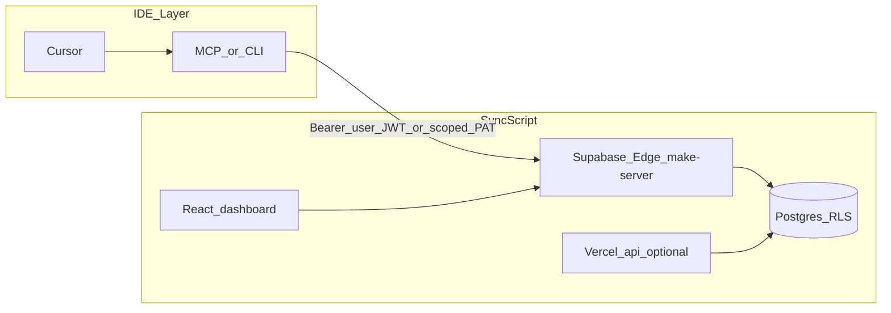

# Cursor + SyncScript alignment and social productivity roadmap

**Status:** Canonical product + engineering roadmap (preserved in git).  
**Last updated:** 2026-04-30 — heatmap + HTTP client pointers corrected; implementation gaps closed where noted below.

---

## Clarifications (source: operator / product)

### Logged-in work as source of truth

When you use **syncscript.app** while signed in, task / goal / calendar mutations that already hit the backend should continue to drive **energy** and **history**. Cursor should not try to “replace” that; it should emit the same kinds of events (complete task, log focus block, link a commit/session) through **authenticated** APIs so the app stays canonical.

### “Facebook for AI + scheduling”

Treat it as a **layered release**: private analytics first, then friends-only, then optional public snippets — **never** default public activity.

### Heatmap placement (corrected 2026-04-30)

**Previous draft** claimed `IndividualProfileView` used `Math.random()` for the grid — **that is obsolete**.

**Current behavior:** `src/components/IndividualProfileView.tsx` loads **real daily counts** from Edge **`GET /activity/summary`** (`fetchActivitySummary`) and builds a full-year grid (zeros for days with no rows). The product split remains: **private heatmap first**; optional “show friends” via Settings → Privacy; aggregated / opt-in public summaries only later.

### Can Cursor conversations auto-append to MEMORY.md?

**Not natively.** Cursor does not ship “append every chat to a repo file.” `MEMORY.md` quick context states the supported pattern: **curated markdown + rules**, not full transcript ingest (see `MEMORY.md` ~L10–11).

**Practical automation (pick 1–2):**

1. **Session ritual (zero code):** End important sessions with “summarize decisions → append to `memory/YYYY-MM-DD.md` or a dated `MEMORY.md` section.”
2. **Cursor Hook (light code, local only):** On stop / composer-done, a hook appends a one-line stub to `memory/YYYY-MM-DD.md` — still not the full conversation unless you paste it.
3. **Agent rule:** Keep `.cursor/rules` saying: after substantive decisions, **propose** a MEMORY bullet; human approves merge.

**Recommendation:** Raw logs in **`memory/YYYY-MM-DD.md`**, distilled bullets in **`MEMORY.md`** — same discipline as `AGENTS.md`.

---

## Architecture (target state)

**HTTP contract (corrected):** External tools (Cursor MCP, scripts) call the **same Supabase Edge** host as the signed-in dashboard for tasks and productivity: **`make-server-57781ad9`** (`/tasks`, `/tasks/:id/toggle`, `/activity/*`, `/business-plan`, …). See **`public/openapi.json`** (tag **ProductivityEdge**) and **`integrations/cursor-syncscript-mcp/README.md`**.

**Do not cite** `src/services/data-service.ts` as the live task client: it was a legacy stub for **non-task** services. As of 2026-04-30, **`TaskService`** in that file **delegates to `taskRepository`** (same Edge routes as `SupabaseTaskRepository`). The dashboard’s primary path remains **`taskRepository`** via `TasksContext`.

**Energy awards:** Follow existing server-side or context paths; do **not** edit protected energy core files in `.cursor/rules/02-protected-files-never-touch.mdc` without an explicit exception.

---

## What already exists (leverage)

| Building block | Location | Notes |
|----------------|----------|--------|
| Enterprise tabs + Plan | `src/components/pages/EnterpriseToolsPage.tsx`, `EnterpriseBusinessPlanTab` | Plan tab wired |
| Task HTTP (live) | `src/services/SupabaseTaskRepository.ts` → Edge `/tasks`, `POST /tasks/:id/toggle` | Canonical |
| Task bridge for scripts | `src/services/data-service.ts` → `TaskService` → `taskRepository` | Delegates to Edge |
| Team / friend activity UI | `TeamActivityFeed.tsx`, `FriendsActivityFeedPanel.tsx`, `edge-productivity-client.ts` | Friends strip uses RPC-backed feed |
| Profile heatmap | `IndividualProfileView.tsx` | Real `activity/summary` data |
| Hermes / executor bridge | `integrations/research/NEXUS_LLM_COMPAT_AND_EXECUTOR_BRIDGE.md` | Reuse trust model for future bridges |
| Activity spine spec | `integrations/research/SYNCSCRIPT_ACTIVITY_AND_SOCIAL_SPINE.md` | Schema + threat model |

---

## Phased implementation (status)

### Phase 0 — Product + privacy spec

- **Done:** `SYNCSCRIPT_ACTIVITY_AND_SOCIAL_SPINE.md` + `INDEX.md` row.

### Phase 1 — Enterprise Business Plan tab

- **Done:** Plan tab, Edge `GET/PUT /business-plan`, markdown export, Settings + OpenAPI + MCP tools.

### Phase 2 — Activity spine

- **Done:** `user_activity_events`, Edge readers/writers, `recordTaskCompleted` on task completion (`email-task-routes.tsx`).
- **Done (2026-04-30):** `POST /activity/events` **rate limit** (60/min per user, 429).
- **Done (2026-04-30):** **Goal completion** emits `goal_progress` (private) from `useGoals.ts` via `postActivityEvent`.
- **Deferred:** **Calendar “done”** auto-insert — needs one authoritative calendar-save path; until then clients may POST `calendar_event_done` where appropriate.

### Phase 3 — Cursor inline integration (API-first)

- **Done:** PAT, OpenAPI, `integrations/cursor-syncscript-mcp/`.

### Phase 4 — Social layer

- **Partial:** Friends prefs + feed RPC + UI strip; full invite/block UX may expand over time — see spec.

---

## MEMORY.md: what to add when you ship more

- Short **Product — social + external IDE bridge** updates: goals, privacy defaults, API entrypoints, what Cursor may log.
- Do **not** paste personal email into MEMORY; use “primary operator account” only if needed for ops.

---

## Risks and constraints

- **Security:** PATs and MCP must stay scoped, revocable; never log secrets or full prompts to `user_activity_events`.
- **Compliance:** Public “how much you work” surfaces need **opt-in** and **block** first.
- **Protected files:** Touch Enterprise, productivity Edge, new components — **not** Nexus/energy core unless explicitly approved.

---

## Related files (quick jump)

- `MEMORY.md` — § Product — social + external IDE bridge  
- `AGENTS.md` — memory discipline  
- `.cursor/rules/02-protected-files-never-touch.mdc`  
- `public/openapi.json` — ProductivityEdge  
- `integrations/cursor-syncscript-mcp/README.md`
